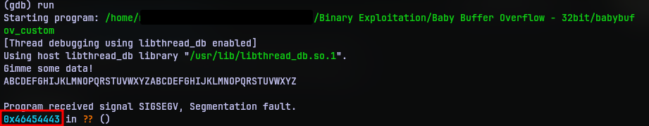
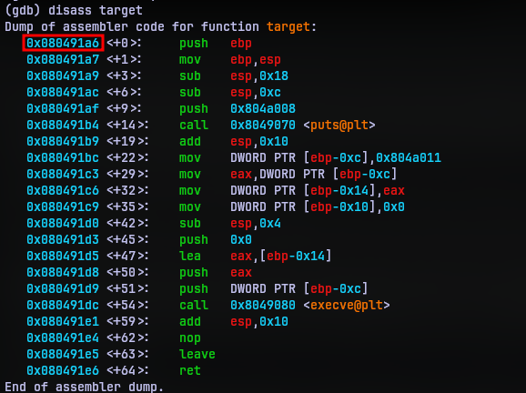
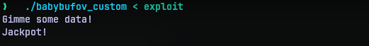
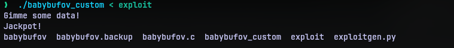
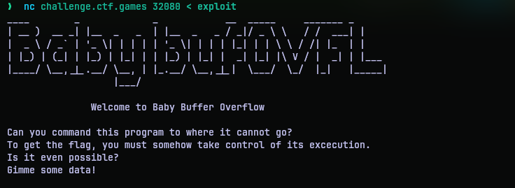
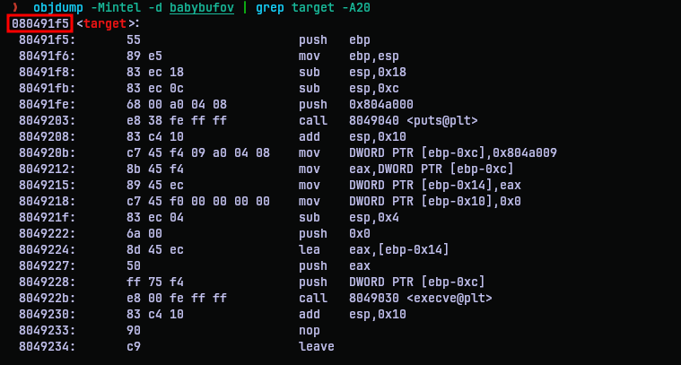
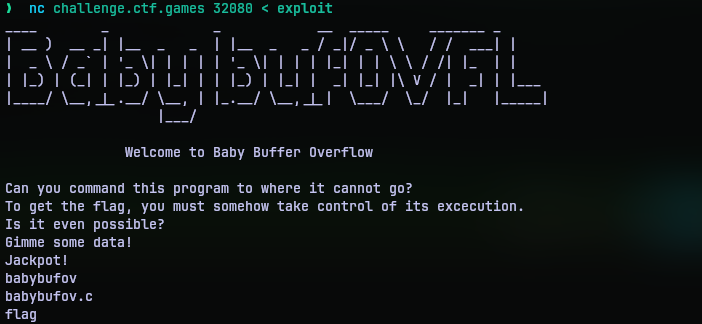

# Baby Buffer Overflow - 32bit
## Challenge Statement:
Author: @aenygma

Can you command this program to where it cannot go?  

To get the flag, you must somehow take control of its excecution.  

Is it even possible?

Attachment: [babybufov](babybufov), [babybufov.c](babybufov.c)

**Note**: This challenge was accompanied with a per-user instance

## Solution:
Opening the C source file given in the attachment section, we can see that it is a fairly straight forward program. There is the main function which requests some data using `gets`. If you have spent some time with C programming you would've known that this is a vulnerable function. The problem with this function is that it takes input with no limit on it's length. Consequently, it writes data to addresses beyond the space reserved or allocated for the string causing a, that's right, a **buffer overflow**.

Now due to some issues with the linker I couldn't execute the binary provided directly. Luckily the source code had a comment to indicate how the program is compiled. So I used:

```bash
gcc -fno-pie -no-pie -Wno-implicit-function-declaration -fno-stack-protector -m32 babybufov.c -o babybufov
```

Notice that the compilation parameters turn off the stack protection, which makes write to stack possible. So obviously we are supposed to redirect execution flow to the uncalled `target` function in the code. 

Here is a awesome [video](https://www.youtube.com/watch?v=8QzOC8HfOqU&list=PLhixgUqwRTjxglIswKp9mpkfPNfHkzyeN&index=15) from liveoverflow that depicts this in a more illustratively. I suggest you watch the entire playlist if you are new to this sort of things.

So in a gist, function calls push return address on the stack so that when the function ends it can return the control to where it came from. The same stack also houses local variables such as the one that collects the string from the `gets` function. Now the idea is that we put enough characters in the string so that it overflows to the return address value and overwrites it. 

A little knowledge of the GNU Debugger (gdb) is advisable for doing the below steps.

First we need to know how many characters it takes to overflow to the return address. Usually this is the string (buffer) size, but it can be more due to other variables. So I put in a recognizable string like `ABCDEFGHIJKLMNOPQRSTUVWXYZABCDEFGHIJKLMNOPQRSTUVWXYZ` as input to observe the return address. 



Of course it seg-faulted because there is no valid address as `0x46454443`. But if you notice this is not a random address. 46 is the letter F in hexadecimal. So the address translates to `FEDC`. The reason why it is in reverse is because of the endianess. So now we now the address can be overwritten from the second `C` in the input.

Now we need to know the address of the function we need to redirect to. For this we can disassemble the target function to get the address of the first instruction in the address.



So the address to redirect the control is `0x080491a6`. We can't manually type in the return address is because it will be taken as string and stored differently in the stack. So I put together an python script [exploitgen.py](exploitgen.py) that generates an exploit input that can overwrite the return address. 

```python
import struct

buf = b"abcdefghijklmnopqrstuvwxyzab"
addr = struct.pack("I", 0x080491a6)
exp = buf + addr

with open("exploit", "wb") as f:
    f.write(exp)
    f.write("\n".encode())
```

The above code has the buffer required to fill the input buffer and adds the address at the end of it to overwrite the return address. The [struct](https://docs.python.org/3/library/struct.html) module offers packing and unpacking data between python and C data types with specific sizes. Since an address is 4 bytes long, I have used unsigned int (the `I`) as the target type. The newline is to mimic the press of enter button to finish input.

Once the exploit is generated, we can redirect it to the program directly like:
```bash
./babybufov_custom < exploit
```


Yup, we got the jackpot message in the target function. So we are successful in redirecting the execution. One might ask, is that it? Visiting again the source code for target we can see there is a shell that gets invoked. Since we give no more input it simply exits. So I added a little more to the [exploitgen.py](exploitgen.py). 
```python
import struct

buf = b"abcdefghijklmnopqrstuvwxyzab"
addr = struct.pack("I", 0x080491a6)
exp = buf + addr

with open("exploit", "wb") as f:
    f.write(exp)
    f.write("\n".encode())
    f.write("ls\n".encode())
```

Now it lists the files in the directory it is on as shown below: 



And now we have code execution as well. Now it's time to test this on the real thing. The challenge came with a per-user instance. Spinning it up gave a netcat command to the program directly. So I redirected my exploit to the netcat program:



It didn't work. I tried a couple more times to meet with the same result. But **it worked on my machine**. For those who already figured out what went wrong, well done. It took me quite a while, longer than I would like to admit. You see the problem is that I recompiled the code in my system, which made the addresses different. So I was redirecting the code to a wrong address. 

Since we have the original binary, it will should the same addresses as the one over netcat. So I used objdump to get the address of the target function.



Armed with the actual address I need, I put that in my exploit program, generated an exploit and redirected it the netcat program.



So it appears there is a file `flag` in the same directory as the program. So I added a `cat flag` to my exploit and repeated the same.


So there it was, the flag. This is quite simple if you know your basics well (and don't do silly mistakes like me).


