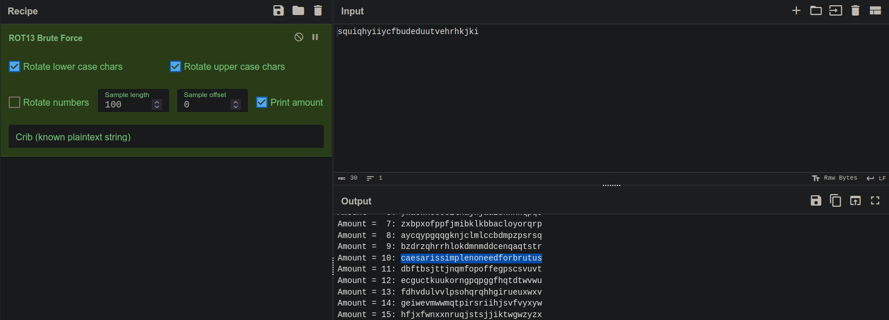

# No need for Brutus
## Challenge Statement
Author:@aenygma

A simple message for you to decipher:

`squiqhyiiycfbudeduutvehrhkjki`

Submit the original plaintext hashed with MD5, wrapped between the usual flag format: `flag{}`

## Solution:
The title includes Brutus who is known for betraying Julius Caesar. Caesar happen to be named after a cipher he created, The Caesar cipher, also known as ROT cipher.

This suggests that the cipher provided might be a ROT cipher for which we don't know the key for.

Using [Cyberchef](https://cyberchef.org/) we can use the recipe ROT13 Brute Force to list all possible plaintext for the cipher.



We find a plain text with key value of 10. Since the challenge requires us to use the MD5Sum of this plaintext we can calculate it using:


```bash
echo -n "caesarissimplenoneedforbrutus" | md5sum
```

Covering the obtained hash with flag format yields the flag
