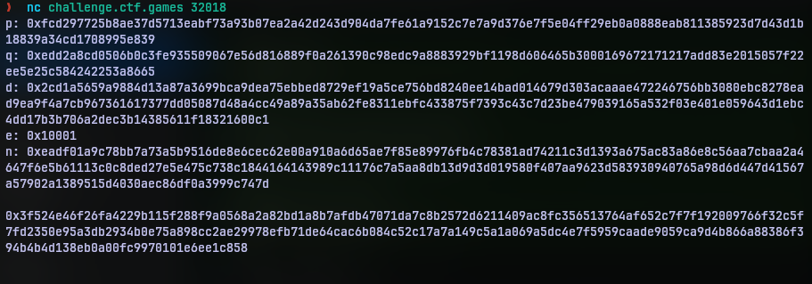
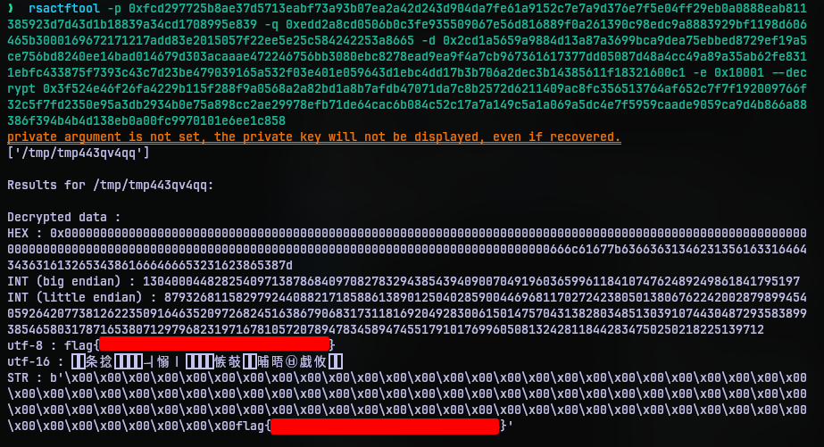

# Strive Marish Leadman TypeCDR
## Challenge Statement
Author:@aenygma

Looks like primo hex garbage.

Maybe something went wrong?

Can you make sense of it?

**Note**: This challenge was accompanied with a per-user instance

## Solution:
On spinning up the per-user instance, I was given a command to use Netcat into the instance. 

On connecting it just print out the following data and exitted.

Now if you have worked with cryptosystems you could have recognized what this is right away. But those who don't, this is variable for a RSA public cryptosystem.

The given are everything that needed to encrypt and decrypt data.

A quick run down of that is:
- `p` and `q` are supposed to be very large prime numbers
- `n = p * q`
- Now a value called Euler's phi function for the value `n` is calculated as `phi(n) = (p-1)*(q-1)`
- Now a random value `e` is selected such that `e < phi(n)` and `e` and `phi(n)` are co-prime
- This `e` is the public key
- Now the corresponding private key is derived such that `d*e = 1 mod phi(n)`
- With this one can encrypt message `m` to cipher `c` with public key as `c = (m^e) mod n`
- This can be reversed or decrypted using private key as `m = (c^d) mod n`

Since we have all the variables and assuming the data in the bottom is ciphertext, this boils down to a simple decrytion.

I used a tool called [rsactftool](https://github.com/RsaCtfTool/RsaCtfTool) to get it done.

By just plugging in the values of p, q, d, e and data to decrypt, the tool even decoded the output to UTF-8 making my job easier.

