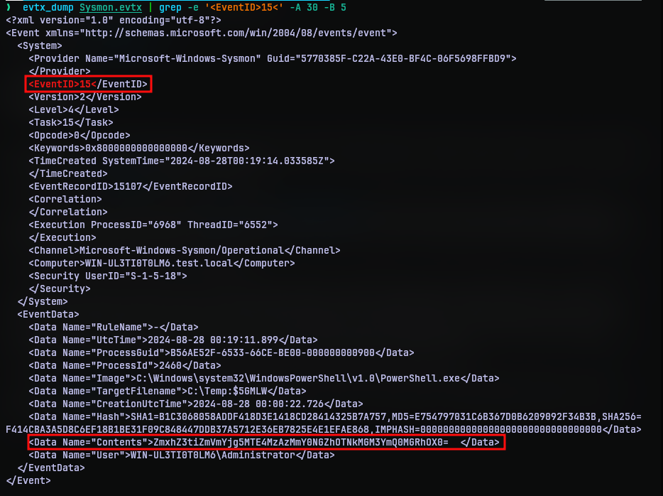
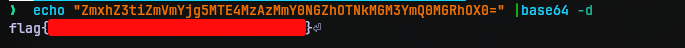

# Hidden Streams
## Challenge Statement:
Author: Adam Rice (@adam.huntress)
  
Beneath the surface, secrets glide,  

A gentle flow where whispers hide.  

Unseen currents, silent dreams,  

Carrying tales in hidden streams.  

  
Can you find the secrets in these Sysmon logs?

Attachment: [Challenge.zip](Challenge.zip)

## Solution:
The zip contains a EVTX Sysmon log file. You may use the windows event viewer to open this or you could use something like [evtx_dump](https://github.com/omerbenamram/evtx) to dump it as XML.

Some time ago I have watched this [video](https://www.youtube.com/watch?v=5Bxl6mVSLEk) from [John Hammond](https://www.youtube.com/@_JohnHammond)'s Channel where he explains about hiding data about alternate data streams. Since, he is working in Huntress, it gives me enough reason that this might exactly be the case. But we only have an event log.

A quick internet search on how to find alternate data streams yielded results, but nothing came up in context of event logs. So I had to broaden my search and checked if any event is logged when a data stream is created, written or modified. Soon I found out event ID 15, FileStreamCreateHash, logs creation of streams with hashes and contents in it. Since alternate data streams are also streams this seemed good.

I used to [evtx_dump](https://github.com/omerbenamram/evtx) and grep to filter for event ID 15 and I got a hit. After some tinkering with the how much data I wanted grep to display, I got the event down.

Under the content section we can notice some base64 encoded data. Decoding it, got the flag.

