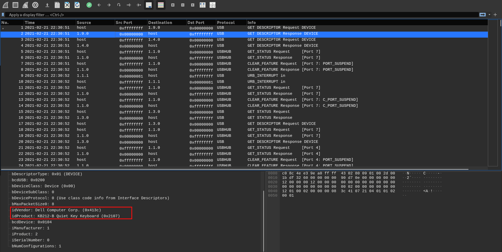
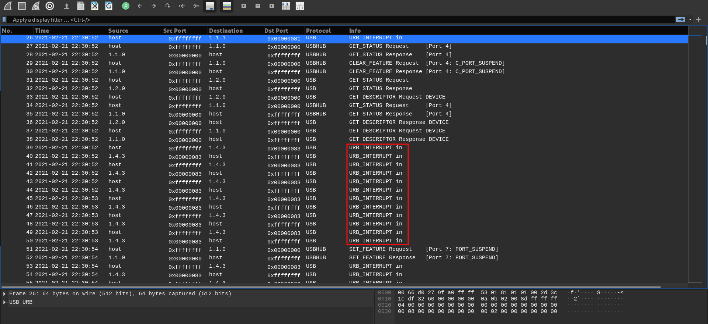
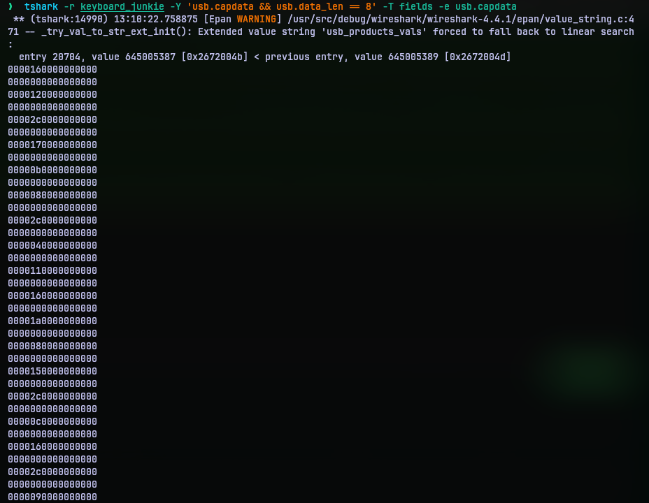
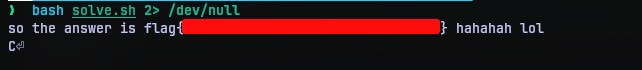

# Keyboard Junkie
## Challenge Statement:
Author: @JohnHammond
 
My friend wouldn't shut up about his new keyboard, so...

Attachment: [keyboard_junkie](keyboard_junkie)

## Solution:
Running file command on the attachment reveals it to be a PCAP file. Opening it with a wireshark, a packet analyzer, we can observe USB capture data. 

On top of the capture we can even see the request and response of USB device descriptor. This is what happens when you connect a USB input device to a host. The host requests the descriptor for what type of device it is and the device responds. Based on the response we can conclude that, the device is a Keyboard.

We can also observe a lot of URB (USB Request Block) interrupts in the capture. These are keystrokes recorded by the keyboard. We can't directly see what was typed in as it is not that simple with keyboard. Keystrokes maybe a simple keypress, or a combination of control keys and others. So they have a representation format of their own. This has been explained to good detail in [this](https://05t3.github.io/posts/Dissecting-USB-Traffic/#decoding-hid-data) blog. 

To extract the keystroke data, I used `tshark` to extract the captured data. This is how the data actually looks like:

Now we need to decode this data. We can do it ourselves but I thought someone might have already put together a script for this. A quick internet search later, I found a page on [hacktricks.xyz](https://book.hacktricks.xyz/generic-methodologies-and-resources/basic-forensic-methodology/pcap-inspection/usb-keystrokes) about usb pcap inspection and and how we can decode it using [ctf-usb-keyboard-parser](https://github.com/TeamRocketIst/ctf-usb-keyboard-parser).

I then just cloned the repo, put the commands for extraction and execution in [solve.sh](solve.sh). Executing them yielded the flag.

