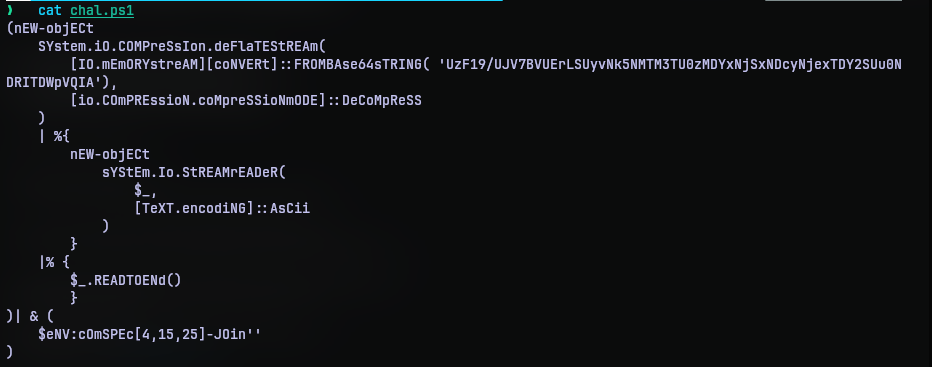
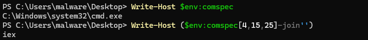
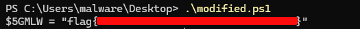

# Obfuscation Station
## Challenge Statement:
Author: @resume

You've reached the Obfuscation Station!  

Can you decode this PowerShell to find the flag?  

**Archive password: `infected-station`**

Attachment: [challenge.zip](challenge.zip)

## Solution:
Extracting the archive, we have a powershell script with the following contents:

The script seems to decode a base64 data, decompresses it to a stream and converts it to a string and then extracts some characters from an environment variable and joins them. I thought 'iex' and I was right.

So I tried to put the string into a variable and output it. But the script kept throwing errors at me. So I wrote another script mimicking the same logic, but cleaner. Putting them at [solve.ps1](solve.ps1), and executing it, gave the flag.

