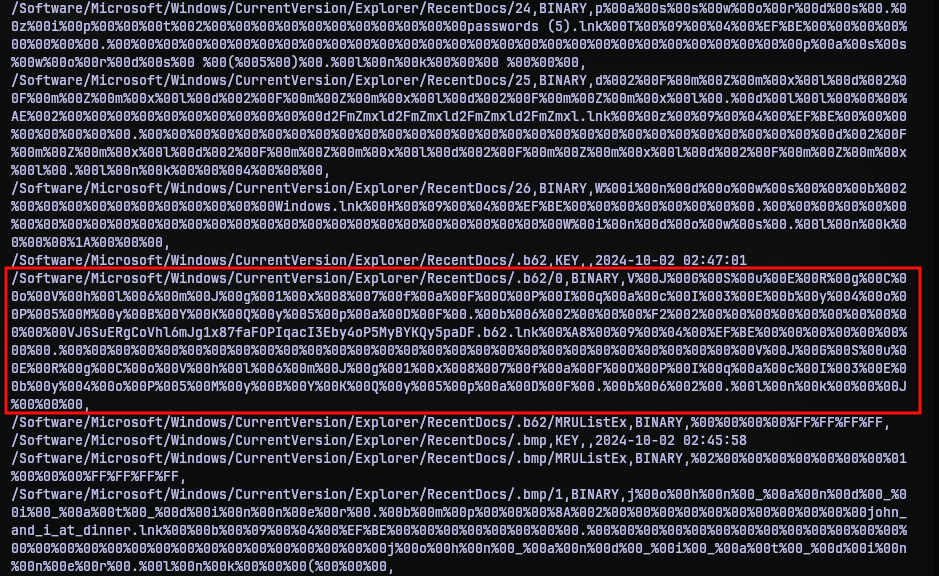
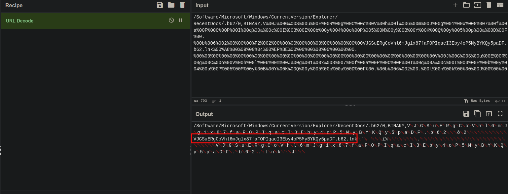
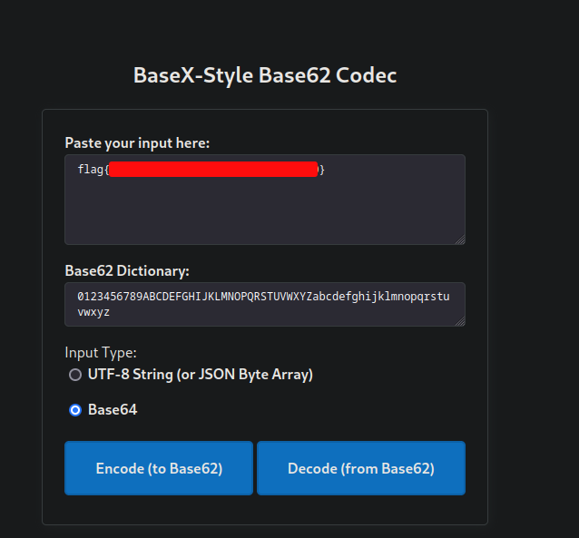

# Obfuscation Station
## Challenge Statement:
Author: @sudo_Rem

A user interacted with a suspicious file on one of our hosts.  

The only thing we managed to grab was the user's registry hive.  

Are they hiding any secrets?

Attachment: [NTUSER.DAT](NTUSER.DAT)

## Solution:
The attachment is the NTUSER.DAT file of some windows host. NTUSER.DAT is a special file that is located in the userprofile of each user. This file stores the registry keys of a particular user, also called as registry hives.

One may open it by loading the hive onto the windows registry editor or use tools to explore the keys directly. I used a tool called `reglookup`.

The challenge description says that the user interacted with a "suspicious" file. So, if a user interacted with it, then it must be noted under RecentDocs folder in the hive. Using `reglookup` I could list the keys under the RecentDocs folder using the command:

```bash
reglookup -p /Software/Microsoft/Windows/CurrentVersion/Explorer/RecentDocs NTUSER.DAT 
```

There were several entries in there but not a lot. Going through those, the below entry caught my eye.



Why? It is unusually long. And it had a file extension type I didn't recognize, .b62. Of course most of the data is URL encoded, so put it in cyberchef to decode it.



URL decoding didn't change much, but allowed me to see that it was not a .b62 file but rather a .lnk file. But we don't have access to the file, so we can't analyze the file. Then it hit me, the name of the file was unusually long, and don't seem random. Looks like a encoding, then it again hit me, .b62 refers to base62 encoding.

So I found a [base62 decoder](https://base62.js.org/) on the internet and put in the file name. Decoding it gave the flag.




