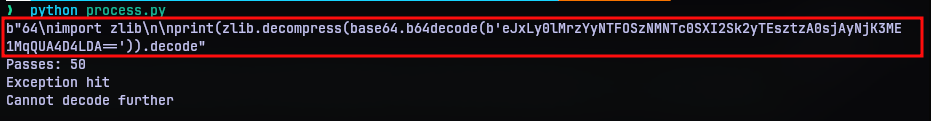
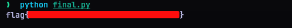

# Discount Programming Devices
## Challenge Statement:
Author: @sudo_Rem  
  
I used a tool on the internet to obfuscate my script!  

But I lost it, and I don't know how to get it back.  

Maybe you can help?

Attachment: [oops.py](oops.py)

## Solution:
In this challenge, we have a python script that has a lambda function declaration assigned to an underscore `_`. It takes an argument `__` and has the contents as:

```python
_ = lambda __ : __import__('zlib').decompress(__import__('base64').b64decode(__[::-1]))
```

What's going on here is simple. The argument `__` is reversed, and passed to base64 decoder and then in turn passed to the decompress function from the `zlib` module.

Following this declaration, is an exec function call that references the function pointer and passes on a very lengthy argument. Since the size of the argument was long, I figured it might take several passes to get to the end, so I put a script together [process.py](process.py). 



With the script, we can see that it took 50 passes and finally we have another python code at the end of it. It seems to be of the same logic, but putting the contents in [final.py](final.py) and executing it gave me the flag.



Now it really seems straightforward. But did I actually do anything? I just did what the script would've done but in separate steps. So just to check, now that I know what the script is, I ran the [oops.py](oops.py) directly. It gave the flag just like that.


So I was wondering what was the point, but didn't really think much of it. Then going through the CTF discord server, the challenge author admitted it was indeed a mistake. 


