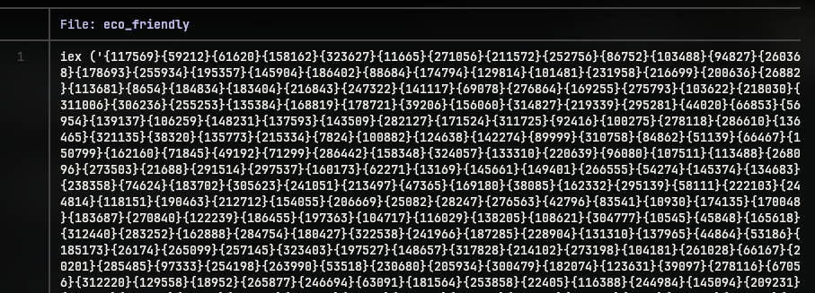
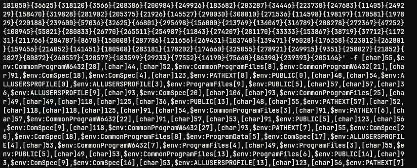
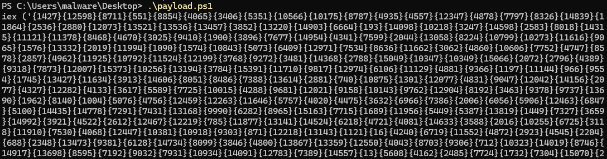
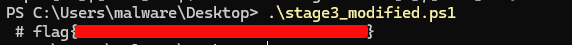

# Eco-Friendly
## Challenge Statement:
Author: @JohnHammond
  
This sample is good for the environment!

Attachment: [eco_friendly](eco_friendly)

## Solution:
For this challenge, we are given a powershell script, or I should say, one very long line of powershell. Opening the given file we can see an iex (Invoke-Expression) cmdlet that will execute whatever command follows it.

But the argument for the cmdlet seems to a string with random numbers in curly braces. If we scroll down for some time, we can find the end of the string with a option `-f` which is used to format strings in powershell.

What follows the `-f` is lots of environment variables with an index number. Which means the script uses, fixed environment variables that is uniform across all Windows machine to construct the payload from the individual characters indexed from said environment variables. The random numbers in curly braces are just positional parameters. This type of technique is used to evade detection from anti-malware solutions which may scan for suspicious keywords.

Now that we know this, we can just replace the `iex` at the starting with a `Write-Host` cmdlet to write whatever the string will be constructed to rather than executing it.

Doing that, saving it to [payload.ps1](payload.ps1) and executing the script, reveals another level of obfuscation with the same technique. So putting that in file [stage1](stage1) and modifying the `iex`  to `Write-Host` in [stage1_modified.ps1](stage1_modified.ps1) and executing again leads to another level of same obfuscation. Repeating the same with [stage2](stage2) and [stage2_modified.ps1](stage2_modified.ps1) leads to another level of obfuscation. Doing it again with [stage3](stage3) and [stage3_modified.ps1](stage3_modified.ps1) finally gave away the flag as a comment. 

I should have anticipated nested levels of obfuscation and written a script to get the process done, but still unsure of what it might hold, I did it manually. But got the flag at the end.

