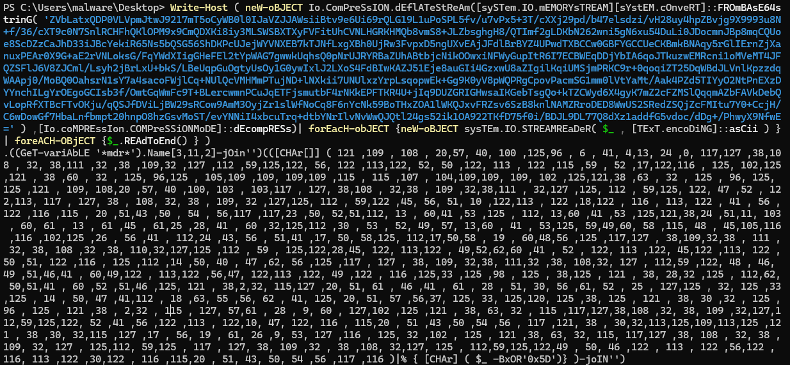

# Palimpsest
## Challenge Statement:
Author: Adam Rice (@adam.huntress)
  
Our IT department was setting up a new workstation and started encountering some strange errors while installing software.  

The technician noticed a strange scheduled task and luckily backed it up and grabbed some log files before wiping the machine!  

Can you figure out what's going on?  

**We've included the exported scheduled task and log files below.**  

The archive password is `infected-palimpsest`.

Attachment: [Challenge.zip](Challenge.zip)

## Solution:
The attachment archive contains 3 event viewer logs (Application, Security and System) and a [Updater Service.xml](Updater\ Service.xml). I first opened the XML file, which is the scheduled task that the challenge description tells about. 

While most of the contents of the XML file is pretty much what you'd find in most scheduled tasks, I was more interested in the actions of the task. As we can see, it is a powershell line, that collects the DNS TXT records from the site `5aa456e4dbed10b.pyrchdata.com`, base64 decodes it, builds a string from it and executes it. So I queries the DNS TXT records myself to find out base64 data in it.

Putting the contents in [txt_records](txt_records) and decoding it, yields a powershell script with some obfuscation. 

The first brackets reference the shell ID which I'm quite sure is constructing `iex` cmdlet. Putting that in [stage1_payload.ps1](stage1_payload.ps1) and modifying the `iex` with `Write-Host` should give us the next part of the payload.

Doing that does indeed reveals the next part of the payload. Now we still have an obfuscated script. The first line now tries to get a variable that matches the pattern `*mdr*` and constructs something. I was pretty sure that is also `iex` as well, but to be sure, I checked. Repeating the same trick we move on to the next stage of payload.

Now this payload doesn't have any base encoded strings, on the contrary [stage3_payload.ps1](stage3_payload.ps1) does something else. But I couldn't fully read it because of the garbled format strings. I decided to clean it and substitute those strings to their result, I had [stage3_cleaned.ps1](stage3_cleaned.ps1) which was more readable.

We can now see clearly, that the payload gets the application event log with source as `mslnstaller` (notice the typosquatting) and filters events with InstanceID within 40000 - 65000, extracts "data" from those logs and writes it to the a file named `flag.mp4` in the AppData folder.

Now we have use for those event log files, opening Application.evtx in windows event viewer and filtering events between 40000 - 65000 with source as `mslnstaller` we have exactly 100 such logs.

Every record out of those 100 logs had a data node with some text and binary data. It is fair to assume that the binary data is what is being written to `flag.mp4` all we have to do is extract it.

Now I can write powershell scirpts to some level, I didn't know how to extract fields from saved log files in it at the time of solving this challenge. So converted the .evtx files to .csv using [this](https://github.com/josephatmwanzia/evtx2csv) tool.

Once I converted it, it was fairly easy for me to put a python script [extract_data.py](extract_data.py) together to extract the binary data and write to a file. The logic behind the script is simple. It opens the csv file and parses it using the `csv` module and then checks each row for the condition required as in the powershell script. Then I used `unhexlify` from `binascii` module to convert the hex to actual binary data and wrote it to a file [from_evtx_data](from_evtx_data).

Even though the powershell script tells us it is an mp4, I was still a little suspicious it might be something else. But when I ran `file` utility on it, it revealed that it is indeed a MP4 video file. Opening it got me:

So it says "It's free real estate" and yeah the flag is there too. I tried using OCR to get the flag from the video, but it had a few mistakes which I had to correct it manually.

