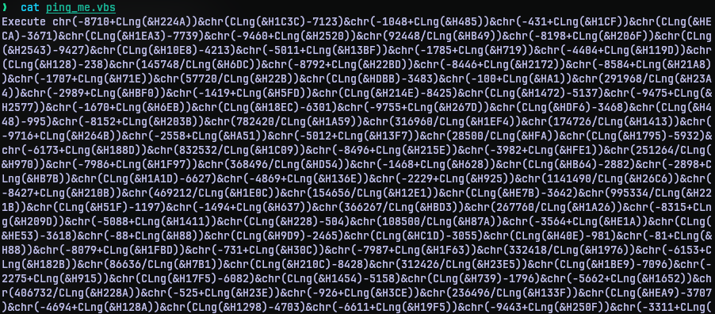
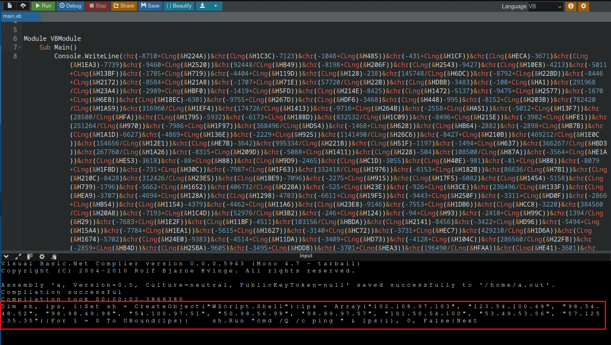
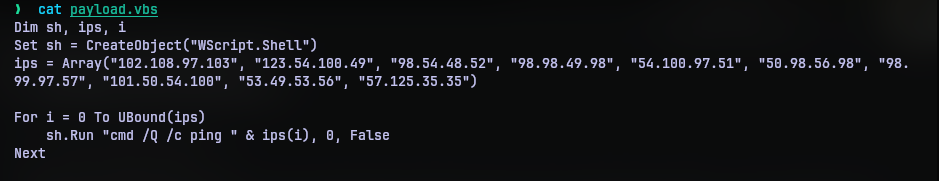
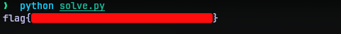

# Ping Me
## Challenge Statement:
Author: @JohnHammond
  
We found this file in the autoruns of a host that seemed to have a lot of network activity... can you figure out what it was doing?

Attachment: [ping_me.vbs](ping_me.vbs)

## Solution:
For this challenge we are given a VBScript.



Now I am not familiar with VBScript, but looking at the script we can observe an "Execute" at the start and a long expression. So it is logical to conclude that the expression evaluates to something and the "Execute" will execute whatever the expression evaluates to. 

In order to know what it really does, we just need to replace "Execute" with some print statement from VBScript. So I opened [onlinegdb](https://www.onlinegdb.com/online_vb_compiler) and it already had boilerplate code to output something (Hello world). I just modified it to evaluate the expression and output it.



Now we can see, that it indeed gets another script which should be VBScript as well. After adding some spaces and newline to it we have:



This script seems to have a list of IP address and runs a ping command on all of them. Well that explains the part of challenge description that says "a lot of network activity", but what now?

The IP address may seem random to an untrained eye. But I recognized them not to be random. You see the each octect in the IP address is a valid ASCII character and most of them are in alphabet and number character ranges.

So I copied the list of IP address, put them in a [solve.py](solve.py) to process them and convert them to a valid string. The script just splits the octets put them in a list and uses `chr` function to convert the octets to valid characters.

```python
ips = ["102.108.97.103", "123.54.100.49", "98.54.48.52", "98.98.49.98", "54.100.97.51", "50.98.56.98", "98.99.97.57", "101.50.54.100", "53.49.53.56", "57.125.35.35"]
chars = []
for ip in ips:
    chars.extend(ip.split("."))

flag = "".join([chr(int(i)) for i in chars])

print(flag.strip("#"))
```

This script gave away the flag.



