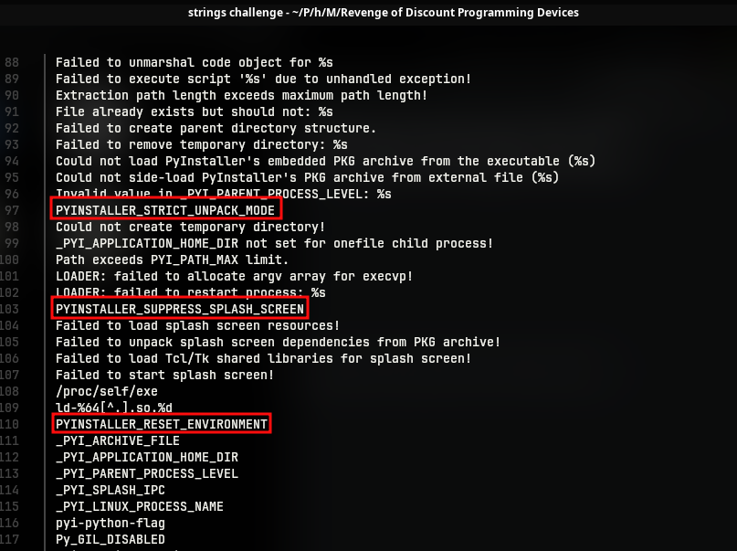
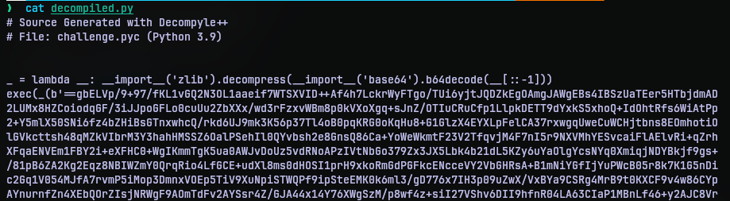
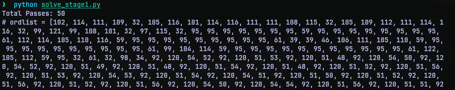
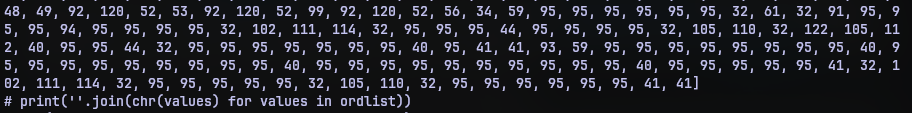
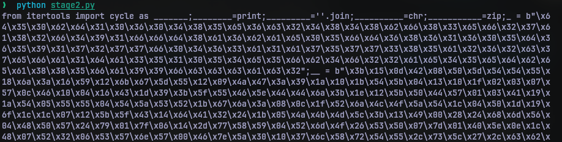
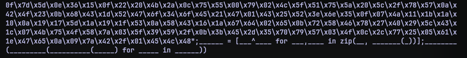
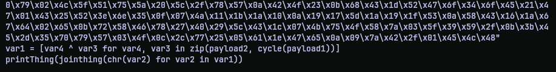
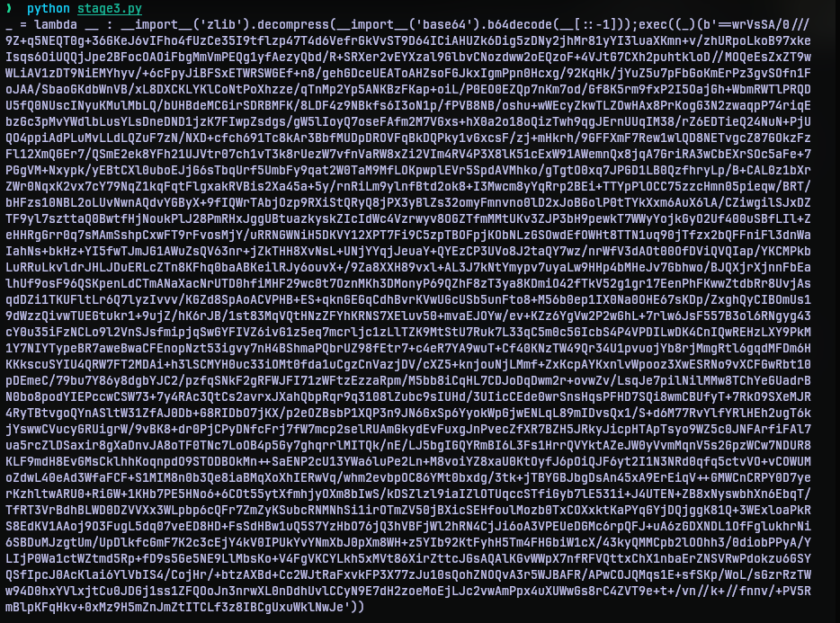
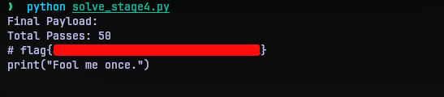

# Revenge of Discount Programming Devices
## Challenge Statement:
Author: @sudo_Rem
  
One of our security analysts learned to avoid printing out flag when obfuscating code!  

Unfortunately, now they've lost that flag.  

Maybe you can help them get it back.

Attachment: [challenge](challenge)

## Solution:
In this challenge we are given a binary, an ELF binary to be specific. Running 	`strings` utility on the binary among the entries we can find strong indicators (as shown below) that the binary has been compiled using [pyinstaller](https://pyinstaller.org/). This is a tool to convert python source code files to executable binaries.

There is this tool called [pyinstxtractor](https://github.com/extremecoders-re/pyinstxtractor) that can extract the contents of a binary that is compiled by pyinstaller.  Using that tool I was able to dump all the contents of the binary into [challenge_extracted](challenge_extracted). Since it is a statically linked binary there were quite a few things that got extracted. But we are focused on the [challenge.pyc](challenge_extracted/challenge.pyc). This file contains the bytecode of the original file that was used to compile.

We still need to convert the bytecode to actual source code before we can work on what it does. For that we can make use of another tool called [pycdc](https://github.com/zrax/pycdc). Using the tool, I converted bytecode file [challenge.pyc](challenge_extracted/challenge.pyc) to [decompiled.py](decompiled.py).

Now we have something to work on. On top of the code we can observe a lambda function that is assigned to a function pointer variable `_` (underscore). It takes an argument which is `__` (two underscores). The function reverses the data it gets, does a base64 decoding and uses the `zlib` module to decompress the decoded contents. Then there is a `exec` function that uses the function pointer `_` and passes a very long string of data to it.

Since the string was very long, I suspected multiple levels of same obfuscation. So I wrote a python script [solve_stage1.py](solve_stage1.py) to run the data till there is a exec function in the code. 

As we see, after 50 passes, we get a long list of numbers. But this list is commented out. At the end of the list there are 2 print statements out of which is one commented out. The first print statement simply joins the result of `chr` function of each number in the list. The other prints out a string. I put this contents to [stage2.py](stage.py) and reversed the comments. 

Since this provides us with another python script, I put that in [stage3.py](stage3.py), and cleaned the names of the variables. The variables were named with different number of underscores whose real names were declared at the start.

After cleaning them, the functionality was revealed to be just an XOR operation between the two long byte sequence and print the output. 

Now we are once again facing the same function as the first round of payload. So I made a copy of [solve_stage1.py](solve_stage1.py) as [solve_stage4.py](solve_stage4.py) and swapped the argument payload. 

And executing [solve_stage4.py](solve_stage4.py) gave away the flag.

