# Strange Calc
## Challenge Statement:
Author: @JohnHammond
  
I got this new calculator app from my friend! But it's really weird, for some reason it needs admin permissions to run??  
  
**NOTE: Archive password is `strange_calc`**

Attachment: [calc.zip](calc.zip)

## Solution:
Extracting the archive, we have a [calc.exe](calc.exe) that appears to be a PE executable. Running `file` command on the executable proves that it is indeed a PE executable but also reveals that it is a UPX packed executable.

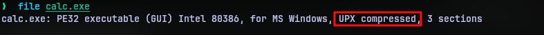

[UPX](https://upx.github.io/) is a "packer" program that compresses executables making them effectively smaller. But since compression increases the entropy of the executable, or in other words garbles the contents in the executable, packers are used to sneak malwares and evade a number of security tools.

We can use the `upx` command line tool to unpack a executable using the command `upx -d <executable>`

I unpacked the binary to [calc_unpacked.exe](calc_unpacked.exe), but this will turn out to be not necessary at all.

I ran the strings utility on the executable trying to find some clues to deduce what kind of functionality the program has. While the unpacked version provided with function names used in the program they weren't enough to make things clear. But then I saw a XML amidst the outputs.

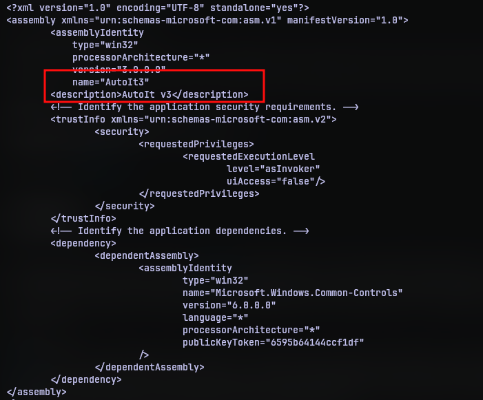

It seemed to be a manifest of some kind, and has the name "AutoIT" in it. I actually had no idea what it was. I never even heard of it at that point. A quick internet search provided the needed details. [AutoIT](https://www.autoitscript.com/site/autoit/) is a scripting language that can be used to automate windows UI and things. 

So that led to another question "What is a script doing in a executable?". That was also quickly answered with a few more searches and I even found a tool called [AutoIt-Ripper](https://github.com/nazywam/AutoIt-Ripper) that can extract AutoIT scripts from executables.

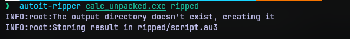

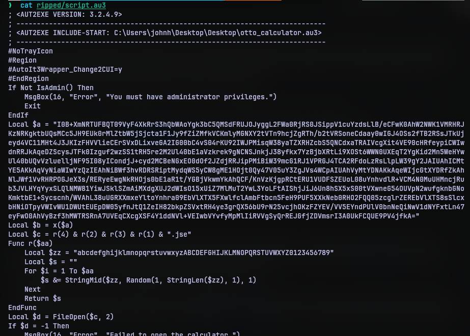

I didn't understand what most of the code does, but the base64 string did catch my eye right away. So I decided to decode what it does.

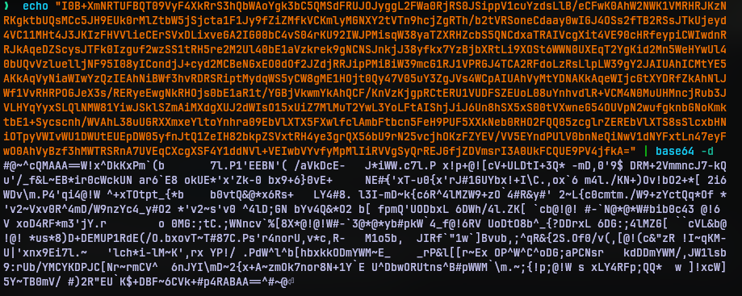

I didn't know what this was either. But the `#@~^` at the start and `^#~@` at the end strongly suggested this is not random data. I found the start in [Wikipedia's list of file signatures](https://en.wikipedia.org/wiki/List_of_file_signatures) and it seems it is encoded VBScript. If it's encoded there must be ways to decode it.

After searching for a little I found several decoders for the job. Like [this](https://master.ayra.ch/vbs/vbs.aspx) one, a [vbe-decoder](https://github.com/JohnHammond/vbe-decoder) repo from the challenge author himself and even cyberchef had a recipe for it. I decided to go with cyberchef for the job.

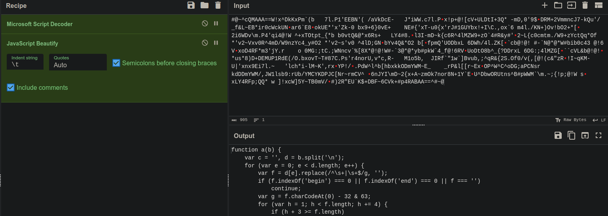

Decoding the script, I noticed that it is not VBScript, but JavaScript. I put on a JS beautifier to read the code better. I put the code in [decoded.js](decoded.js). The function does some decoding stuff, but I was more interested in the part below the function.

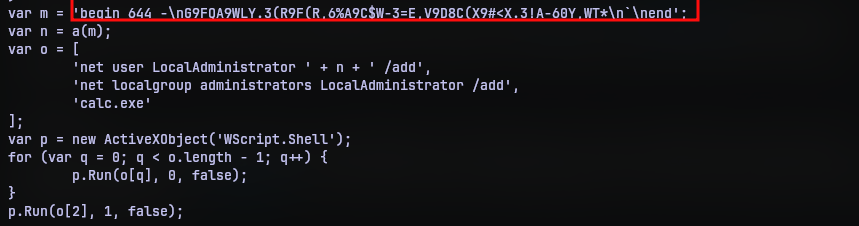

I did know what was in variable `m` though.  This is called [uuencoding](https://en.wikipedia.org/wiki/Uuencoding). This is another binary to text encoding like base64 but was first devised to transfer data between unix machines. Hence the name u-u-encoding. So the script has function `a` to decode the data, create a new user LocalAdministrator, use the decoded data as password, add the user to administrator group and then run calc.exe (again I guess). 

So it seems straightforward right? Decode the uuencoding and we should probably have the flag right? Well, yes but no. The encoded data in the javascript is not standard encoding. So only function `a` can decode it. So I put the function in my browser's javascript runtime and used `console.log` to print the output.

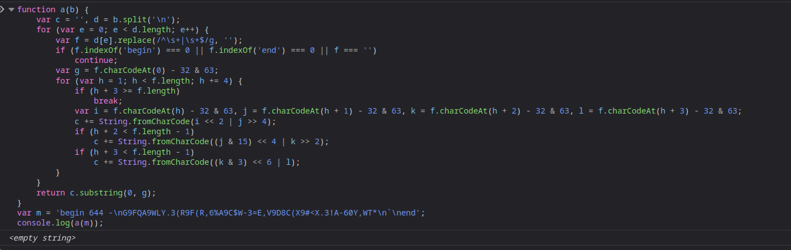

No output? How? I know this was crazy thinking but I thought "Perhaps it will only work on a windows runtime". The return value will be the password of the user LocalAdministrator. So if I execute calc.exe in a virtual machine and then extract password from the account, I could have the return value.

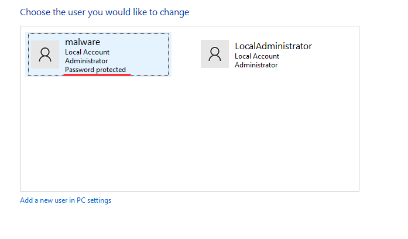

Guess what? The account was indeed created after I executed it, but it had no password. So I thought I went down the wrong rabbit hole and started performing dynamic analysis with [flare-fakenet](https://github.com/mandiant/flare-fakenet-ng), ProcMon, x64dbg and quite others. But nothing seemed to make much sense. 

After sometime I decided to take good look at the function code. And then it caught my eye. 

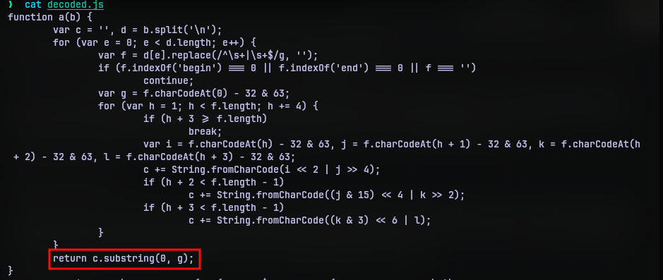

The function returns only a substring of the decoded string. So what was in the entire string? I then added `console.log(c)` before the return statement and ran the code again in my browser's runtime.

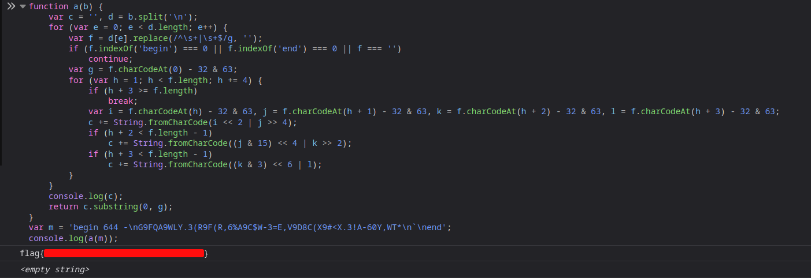

So yeah there was the flag. I was literally looking at it the whole time but it still managed to evade.

