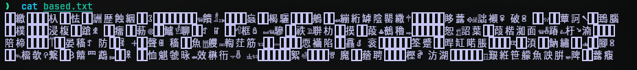
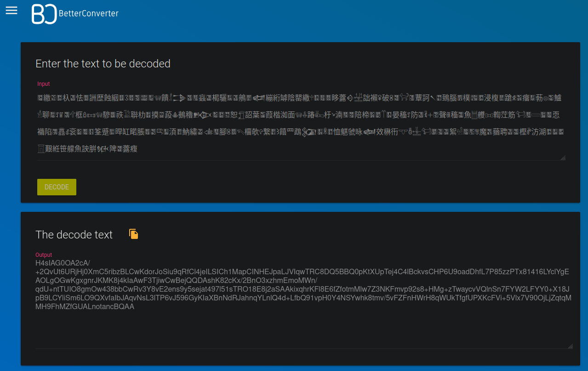
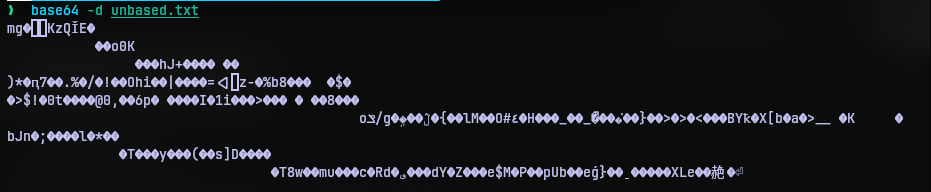
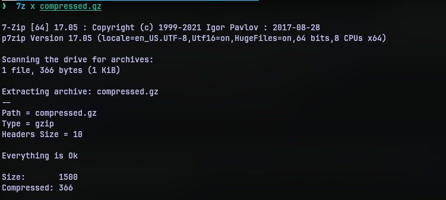
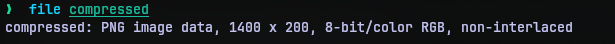
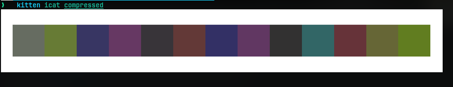
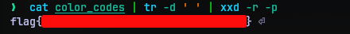

# Base-p-
## Challenge Statement:
Author: Izzy Spering

That looks like a weird encoding, I wonder what it's based on.

Attachment: [based.txt](based.txt)

## Solution:
The attachment is a text file. Opening it, the contents were in a language I didn't know. 



I tried to translate the contents using google translate which detected it to be Cantonese. The title suggest some sort of base encoding so does the challenge description.

I was looking for encodings specifically base encodings that outputs such characters. Incidentally, I stumbled upon several writeups from Huntress 2023 challenge baseffff+1 such as this [one](https://github.com/ThisGuyNeedsABeer/Huntress-CTF-2023/tree/main/baseffff+1_COMPLETED) . And it seems the challenge text followed a encoding base65536. It seemed similar to the one I have now. 

I found a [online decoder](https://www.better-converter.com/Encoders-Decoders/Base65536-Decode) that decodes base65536. So I tried it.



It seems that now we just have a plain base64 encoded data. I put the contents in a file [unbased.txt](unbased.txt). So decoding base64 data, we have some more data.



At first I couldn't make sense of what this is. But the 'mg' at the start of the file made me think it must be a file signature. So I ran the output through file utility.


So this is a gunzip archive. I put the output contents in a gunzip archive [compressed.gz](compressed.gz)  and extracted it using the `gzip` utility.  Extracting the contents gave a single file. Running file utility reveals it to be a PNG image.




Since it is a PNG file, I opened it to view it's contents. It seems to be a strip of colors. What it was? I had no idea.



I examined EXIF data, ran the strings utility, viewed the hex code of the image. After hours of scratching my head and searching for encodings in images and may more, nothing came up. Then I showed it to my friend, who jokingly told me what if the data is the hex codes of color of the images. But guess what, it made sense. There are 13 colors. 3 bytes for one color. 39 bytes of data. 39 characters. The flag usually contains 38 characters.

So I used a color picker to read the hex color code of each color and put them in the file [color_codes](color_codes).  


Now this makes a lot of sense if you know your hex codes. So we just need to convert this to string. That can be achieved by: 

```bash
cat color_codes | tr -d ' ' | xxd -p -r
```



There it was. Sometimes we just need a fresh perspective to look at things.


