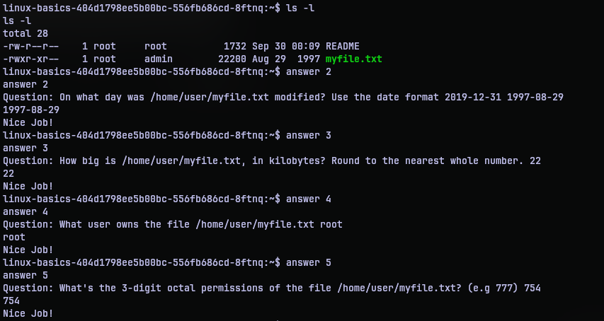

# Linux Basics
## Challenge Statement:
Author: @aenygma

You're expected to answer a series of questions to get the flag.  

To view the questions, and answer them, you'll use the `answer` tool.  

**Display questions:** `answer`  

**Answer a question:** `answer x` where `x` is question number.

**Note**: This challenge was accompanied with a per-user instance

## Solution:
Spinning up the per-user instance for the challenge I was able to connect using netcat to a "shell". Except it wasn't a shell but a relay of data using [socat](https://linux.die.net/man/1/socat). Anyway once I got in I was greeted with a message and as per the challenge description I ran `answer` to see the questions.

The entire challenge is easy if you know your way around a bash shell.

`Question 0: What's your home directory?`

Using pwd command I checked which directory I am currently at. I was in the home directory of a user named `user`.  So the answer is `/home/user`

`Question 1: Search the man pages. What command would you use to generate random permutations?`

I didn't refer the man pages, but a quick search on internet gave me the utility `shuf`. It's one of the core utilities of linux systems apparently. So that was the answer.

`Question 2: On what day was /home/user/myfile.txt modified? Use the date format 2019-12-31`
`Question 3: How big is /home/user/myfile.txt, in kilobytes? Round to the nearest whole number.`
`Question 4: What user owns the file /home/user/myfile.txt`
`Question 5: What's the 3-digit octal permissions of the file /home/user/myfile.txt? (e.g 777)`

Now all these questions are centered around myfile.txt in the home directory. So all it takes is the output of `ls -l` command.

For question 2, the date modified is Aug 29 1997 as seen from the output. Putting it in format required it is `1997-08-29`.

For question 3, the size of the file myfile.txt is required. It is the 22200 number that is the size. But this is in bytes. 1 kilobyte is 100 bytes. So 22200 bytes is roughly 22.2 kilobytes. Since they asked to round to the nearest whole number, 22 is the answer.

For question 4, the user that owns is the 3rd column in the output. The next to that is the group that owns the file. But since we just need the user who owns it, it is root user. So answer is root.

For question 5, we need the 3-digit octal permission of the file. We don't directly have the answer, but we can calculate it from the permissions column which is the first column. The first column is filled with 10 characters. Ignore the first character as it tells us what type of entry it is. The rest of it can be used to derive the octal permission. Each triplet in the 9 characters correspond to one digit in the octal. With r - 4, w - 2, x - 1 and -(dash) - 0. So the octal permission is (4+2+1)(4+1)(4) = 754. That's the answer.

`Question 6: What is the user id of 'admin'?`

We can simply use the `id` command to view the ID related to admin account. So according to the output, it is 1338.

 `Question 7: There is a user 'john' on the system. Can they write to /home/user/myfile.txt? (yes/no)`
`Question 8: Can the 'admin' user execute /home/user/myfile.txt? (yes/no)`

Now again we go back to `myfile.txt`.  So again we just need the output of `ls -l` for this job.

For question 7, as we can see the 'w' is set only for the user. So only the user who owns the file can write to it. So, no, john cannot write to it.

For question 8, the execution flag 'x' is set for both user and group who owns the file. And admin happens to be the group. So yes, admin can execute the file.

`Question 9: Which user on the system, except for you, root, admin and john, can execute /home/user/myfile.txt?`

For question 9, if we recall from question 8, only the user and group who owns the file can execute it. So the user who owns it is root. But what about the group. If anyone other than the given list of user can execute it, they must be a member of group admin. So examining `/etc/group`, we can notice a user `rose` in the group admin. So yeah, that user can execute the file.

`Question 10: /home/user/myfile.txt looks like a txt file, but it actually isn't. What kind of file is it?`

So it is not a text file? When in doubt, use the `file` utility. It reveals that it is a JPEG image. So the answer is jpeg.

Once I give that answer, the program gives me the flag. So that's it? Well yes, but no.

My curiosity wanted me to know what that image is. So I exfiltrated it. For anyone wondering, the tool `xxd` was available. So I dumped the image. Copied the dump to [somehexdump](somehexdump) and did the reverse operation on my machine to [somejpeg.jpeg](somejpeg.jpeg). Opening the file I found:

Hmm. That seems like something. Something great. Or some great rabbit hole. Or a wild goose hunt. I don't know. I spend some time snooping around the instance trying to look for things but then I moved on to the next challenge. So if I find anyone who found it (if it is real) I'll update. 

