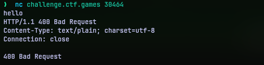
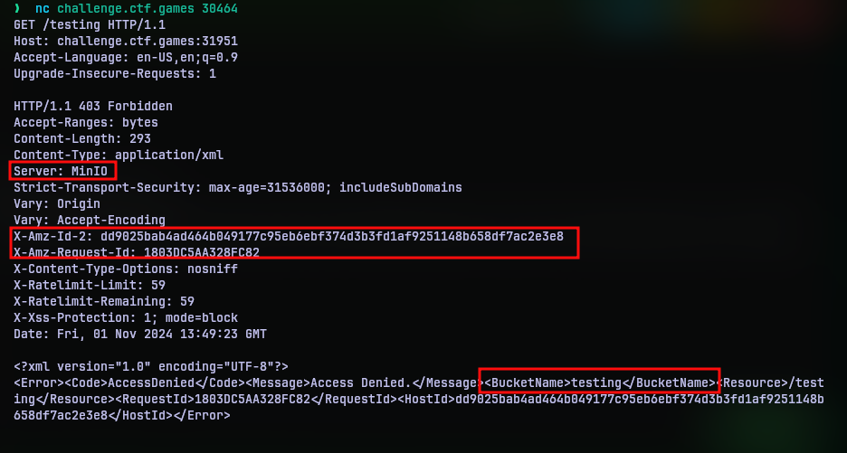
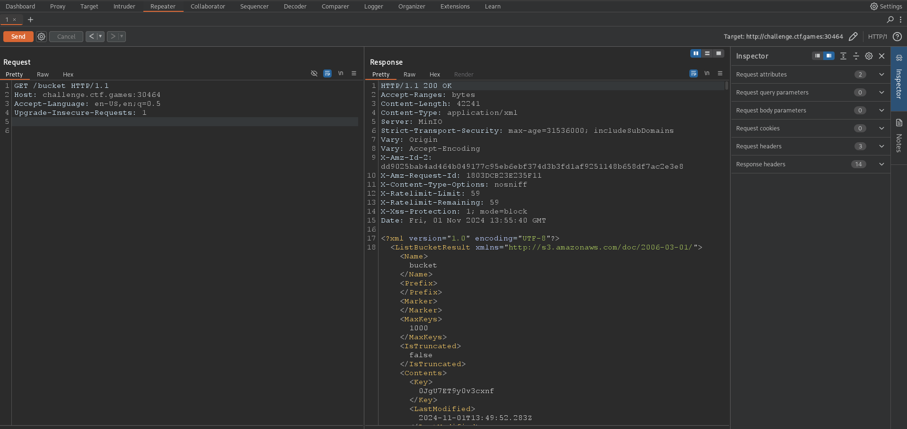
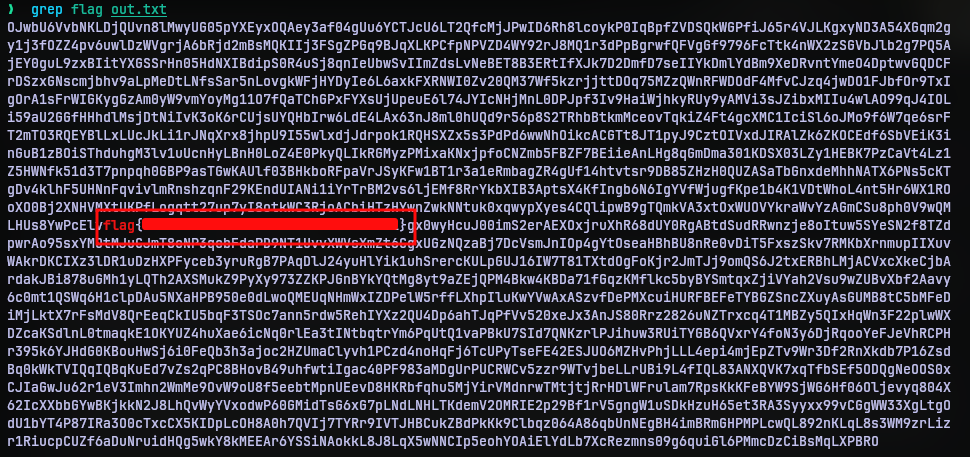

# Malibu
## Challenge Statement:
Author: Truman Kain

What do you bring to the beach?  
  
**NOTE: There are two things to note for this challenge.**

1.  This service takes a bit more time to start. If you see a `Connection refused`, please wait a bit more.

2.  This service will not immediately respond or prompt you... it is waiting for your input. If you just hit Enter, you will see what it is.

Extra tip, once you know what the service is, try connecting in a better way. Then use some of the context clues and critical thinking based off its response and the challenge description. You don't need any bruteforcing once you understand the infrastructure and enumerate. ;)

**Note**: This challenge was accompanied with a per-user instance

## Solution:
Spinning up the per-user instance for the challenge I was given a command line to connect to a instance using netcat. It printed nothing. No prompt. Just like they told in the challenge description. So it seems it is waiting for some input, not sure what. I typed in a hello, because I had to give it something. 



HTTP? Bad Request? So is this a HTTP server? One way to find out. I crafted a valid HTTP request (fancy way of telling I typed it). Since I did not know what endpoints are available I just requested a `/testing` endpoint. 



This confirms this is definitely a HTTP server. And based on the reply we can deduce a few things. First thing is it is running a MinIO server. I didn't know what it really was, so I looked it up. The website tells that it is a S3 compatible storage service. Since I have spent some time using AWS, I knew what S3 is. [S3](https://aws.amazon.com/s3/) is a simple object storage service that is part of the AWS infrastructure. Users can store their files and data in it.

The reply header `X-Amz-Id-2` and `X-Amz-Request-Id` further supports this point that we are communicating with some AWS infrastructure. 

Lastly, the endpoint name I gave is taken as a name of a bucket. Bucket? Yes, S3 allows user to separate files they upload by creating various "buckets". Each bucket acts as a separately independent storage. So it is logical to assume that we are to query a endpoint that points to a valid bucket name.

Now that brings up the question what is the name of the bucket? I thought a clue to this was in the challenge description, "What do you bring to the beach?".

I used Burpsuite's repeater module to modify the endpoint and send requests rather than typing full request bodies. At this point, I was trying every object that I could think of. Sunglasses, towel, sunscreen etc, etc, etc. I even looked up websites with over 75 "essentials" for beach trip. But none worked. It was a 403 error.

You see the answer was right in the face all this time. After all the years I spent watching Tom and Jerry cartoon should have made me realize it. But one can take "bucket" to a beach. Quite ironic huh? Bucket as name for the name of the bucket. So yeah that returned a lengthy XML file.



I copied it and wrote it to [xmlCon.xml](xmlCon.xml). After some more internet searches I found that the node `Key` had the valid endpoints that pointed to files in the bucket. So I put together a python script to collect them all and write it to [out.txt](out.txt). For some reason I couldn't find, the XML parser threw error after error. So I just wrote the program to check for the string 'Key' in the lines it read and collect the file that pointed.

```python
import requests
import sys

with open('xmlCon.xml') as f:
    cons = f.read()
    
content = cons.split('\n')
keys = []

for line in content:
    line = line.strip()
    if line[:5] == "<Key>":
        keys.append(line[5:-6])

port = int(sys.argv[1])
with open('out.txt', 'w') as f:
    f.write(keys)
    for key in keys:
        con = requests.get("http://challenge.ctf.games:{}/bucket/{}".format(port,key)).content.decode()
            f.write(key+'\n')
            f.write(con+'\n')
```

Opening the file, I saw a lot of data. I mean lots and lots of data. My thought was that the flag should be encoded in one of these file data. With the amount of base64 encoding I have encountered I thought it was base64 encoded. But to my surprise, none was the data was valid base64 encoding.

So obviously, I thought I was missing something. Maybe a different kind of encoding perhaps? So search, search and search. After quite some time, in a moment of 'I had no idea what I was even thinking' I ran grep on the file with 'flag' as search string. And guess what, I found the flag. It was right in the face all along. Again.



Moral of the story, overthinking is bad.

