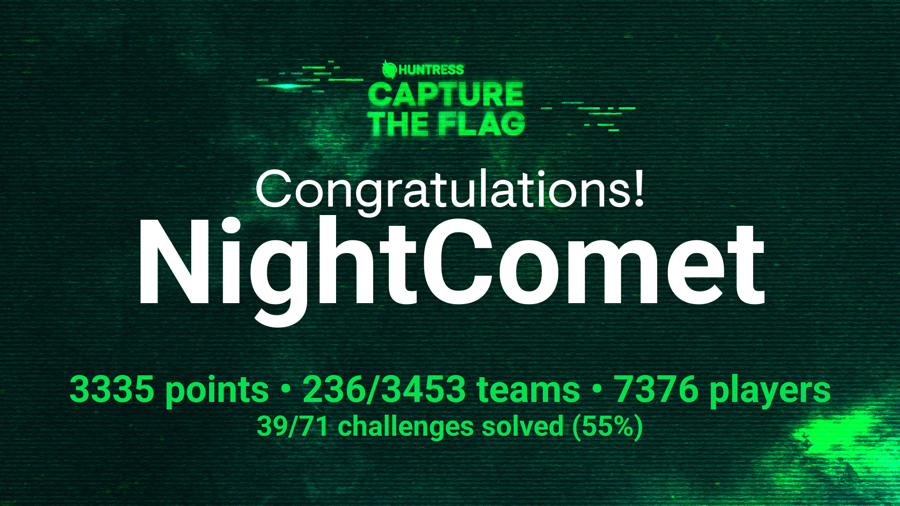

# Huntress CTF 2024 Writeups

This repository contains my writeups for the challenges that I have solved given in the Huntress CTF 2024.

Huntress CTF 2024 was conducted by team [Huntress](https://www.huntress.com/) over a period of the entire month of October in observance of Cybersecurity awareness month. 

I participated as a solo member of a team, under the alias 'NightComet' and was placed 236th out of 3453 teams. This was my first live CTF experience, so I couldn't complete every challenge, but I've learned a lot in the process and quite enjoyed it. 

I have put some time in these writeups to make it as simple as possible so that most people can follow along easily. 
