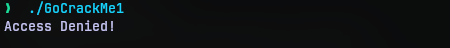
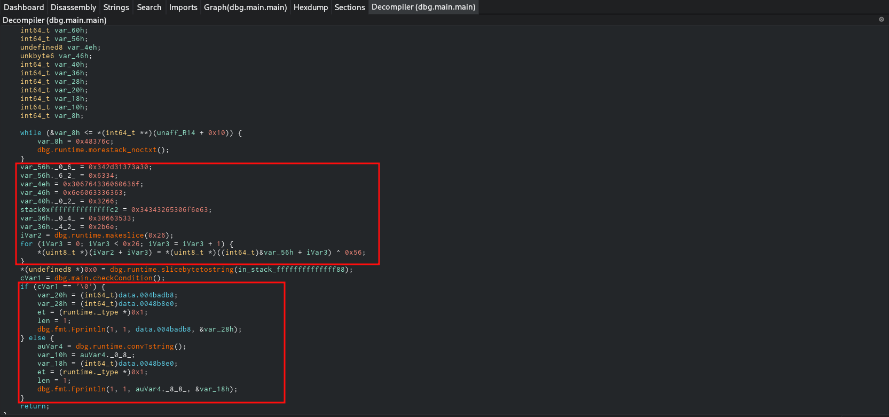
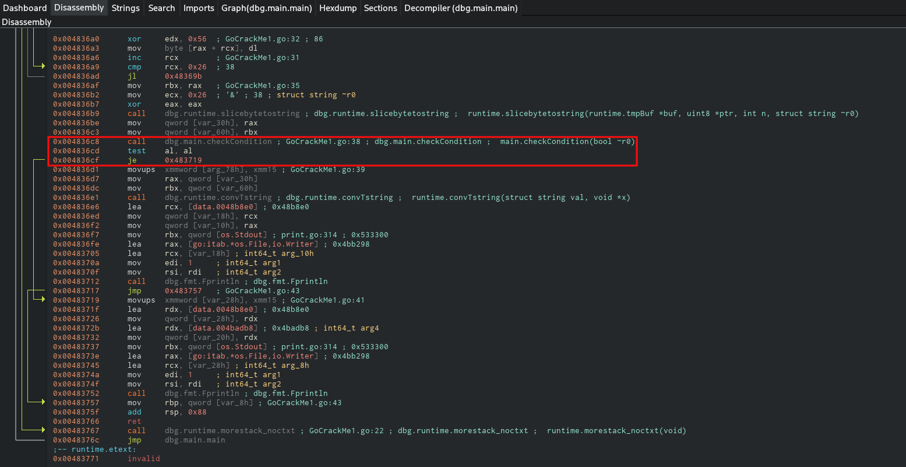
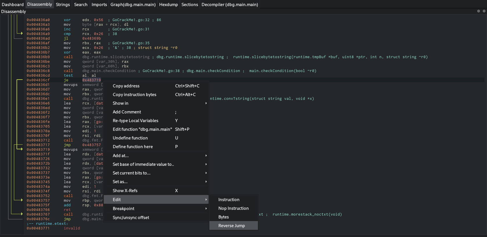
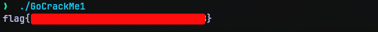
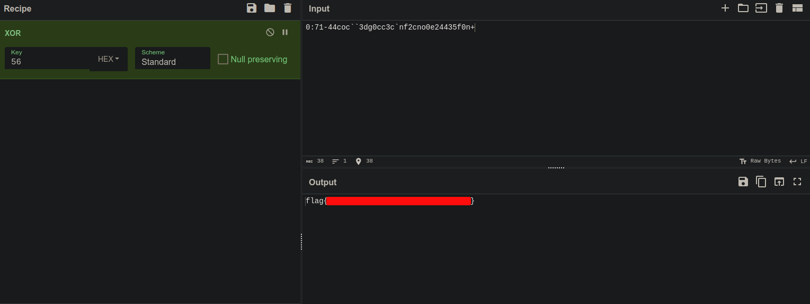

# GoCrackMe1
## Challenge Statement:
Author: @HuskyHacks
  
TENNNNNN-HUT!  
  
Welcome to the Go Dojo, gophers in training!  
  
Go malware is on the rise. So we need you to sharpen up those Go reverse engineering skills. We've written three simple CrackMe programs in Go to turn you into Go-binary reverse engineering ninjas!  
  
First up is the easiest of the three. Go get em!  
  
**Archive password: `infected`**

Attachment: [GoCrackMe1.zip](GoCrackMe1.zip)

## Solution:
Extracting the archive we are provided with ELF executable (linux executable) that is obviously written and compiled with Go language. 

Even though this is a reverse engineering challenge, my first thought was to run it. So when I ran it (of course in a virtual machine), I got an "Access denied!" straight. So there is a good chance there is a conditional statement in the binary, that controls the execution flow.

So I decided to do a static analysis and opened the file in [Cutter](https://github.com/rizinorg/cutter) which is a nice frontend for the [radare2](https://github.com/radareorg/radare2) tool. Opening it, there was a lot of functions inside that turned up in the analysis. But Go language like most language, starts it execution from main function, I decided to look for the main function. 

At first I was focused on the hex data that was being declared and initialized. On a quick look they might seem like data put in different variables across different locations. But you see, they are being written to consecutive locations right after one another. The reason why they are broken is because they are moved to the memory in different instructions. Some decompilers may recognize this and collate them, but the one I used didn't.

But then I looked below it, and saw a if-else statement. Since I already suspected a conditional statement somewhere that controls the flow, I thought this might be it. Both the if and else block contained a fprintln function which is basically print function in Go. Whatever the case might be, if this indeed is the check I'm looking for then reversing the jump statement that directs the execution flow should execute the other part.

Cutter allows one to patch binaries if opened in write mode. So I made a copy of the binary as a backup if it is not what I think it is and switch to write mode. In Cutter any changes made to the binary in write mode is instantly written to the binary which is in contrast to several other tools which requires some sort of explicit 'Patch binary' options to write to binary.

So now, I'm looking for a jump statement in the disassembly.

As I skimmed through the disassembly, the disassembler could locate the call that goes to the function `checkCondition`. Following it is a `test` instruction and a `je` (jump if equal) condition. So basically this `je` instruction is what I'm looking for. 

Cutter provides option to edit the instruction in such a way to reverse the jump, that is change `je` to `jne`. This turns the execution around.

Now that I've reversed the jump now, all I have to do to test my theory is to run it. Which indeed provides the flag.

Even though I got the flag, I still wanted to check if the data I was focused on previously was indeed the data that was xored to give the flag. So I opened cyberchef, copied the data in it and put the key. You may find the key at the other end of the expression in the for loop which is `0x56`.

And it indeed was that data. So this could be considered an alternate method to do the challenge.

