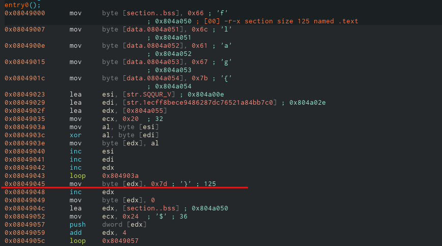

# Stack It
## Challenge Statement:
Author: @sudo_Rem

Our team of security analysts recently worked through a peculiar Lumma sample.  

The dentists helping us advised we floss at least twice a day to help out.  

He also gave us this weird file. Maybe you can help us out.

Attachment: [stack_it.bin](stack_it.bin)

**Note**: This challenge was accompanied with a per-user instance

## Solution:
Running file command on the attachment, we can see that it's an ELF executable.

Since this is a Reverse Engineering challenge I decided look into the disassembly. I used [Cutter](https://github.com/rizinorg/cutter) with Ghidra decompiler plugin to disassemble and decompile the ELF binary for me.

Luckily there was only one function in the ELF executable and it was fairly easy to understand. Let me walk you through it. Below is the screenshot of the decompiled function:

First thing we can notice is some data is written directly to the memory addresses `0x0804a050` till `0x0804a054`.

 
And if you look at the data it is writing, this is hexadecimal for the characters f, l, a, g and {. Seems familiar huh?

Next up we can notice variables `puVar7` and `puVar8` (names given by the decompiler), are initialized to some strings each.  It doesn't matter much right now, but it will in a moment.

We can also see another variable, a pointer to be specific, is made to point the address `0x0804a055`. This is right after where the program wrote the '{' character above. 

Then there is a loop where the contents from `puVar7` and `puVar8` are XORed and put in the address of `puVar4` incrementally, which is just a temporary pointer with same address as `puVar2`, the original pointer. 

Once the loop is over,  couple bytes of data is put at the end of it. It is `0x7d` which is the '}' character and the 0 is essentially the null terminator. So this is our flag. But if you follow along the code, you'll notice data is written again starting from `0x0804a050` which is the start of the flag. 

So essentially, our flag is written to the memory, actually in the stack as it is a local variable, and then rewritten again. So to acquire the flag, we have to stop the execution midway and read the memory directly.

We can use a debugger, a program that can stop execution of a running program and analyze it from various perspectives. It was originally intended for programmers to debug programs, but the print (or cout) statement method is widely used (so do I). So mostly it is used for reverse engineering and malware analysis.

Anyway I went with using the GNU debugger (gdb) to get the job done. Oh and yeah, we are about the execute an unknown binary in a control manner, but still executing it. So it is advisable to do this in a virtual environment so that your main system is not affected. Checkout my [hacky script](https://github.com/ItsMonish/archvm-script) to quickly setup a arch linux vm. 

On loading the program with gdb, we can see that there is no symbols loaded required for "debugging". Simply put we cannot disassemble the code directly.

But we already have the address actually. Cutter already disassembled the code and the assembly code is under the disassembly section.

So we need address of the instruction right after the insertion of '}' character into the address space. So that address seems to be `0x8049045`. So all I have to do is set a breakpoint at that address and examine the address space at `0x0804a050`.

Set up a breakpoint at `0x08049048` using command `break *0x08049048`, then run the program to hit the breakpoint. Examined the address `0x0804a050` with `x/30s 0x0804a050` ( x - examine, 30 - 30 spaces, s - string format ). Why 30 strings? Not sure why but I do it like that. So yup, there's the flag.

