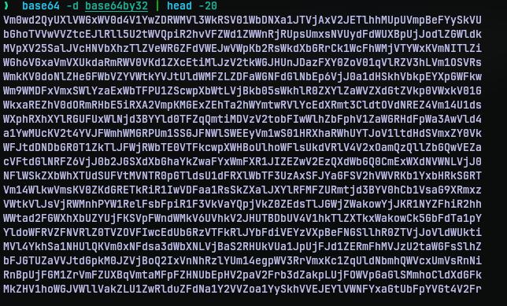

# Base64by32
## Challenge Statement:
Author: @JohnHammond

This is a dumb challenge. I'm sorry.

Attachment: [base64by32.zip](base64by32.zip)

## Solution:
Unzipping the archive we are given with a text file, [base64by32](base64by32).  Opening this file, we see a lot of data in strings. If you are familiar with few types of encodings of binary as text, you may recognize this as base64 encoded data right off the bat. Or you can infer that from the title of the challenge as well.

So I decided to decode the data with command line base64 utility. 



The result of the decoding is also base64 encoded data. Since the lines of data are huge, this made to believe there were lot of rounds of encodings done on the data. So how many times, since the title hints "-by32", I thought this indicated 32 rounds of decoding is required. So I put in a python script [solve.py](solve.py) with the contents:

```python
import base64

contents = ""
with open("./base64by32") as f:
    contents = f.read()

for i in range(32):
    contents = base64.b64decode(contents.encode()).decode()
print(contents)
``` 

Basically I made use of the base64 module of python library and looped the data again and again for 32 times. And my hunch was right. After 32 rounds of decoding the program put out the flag.


