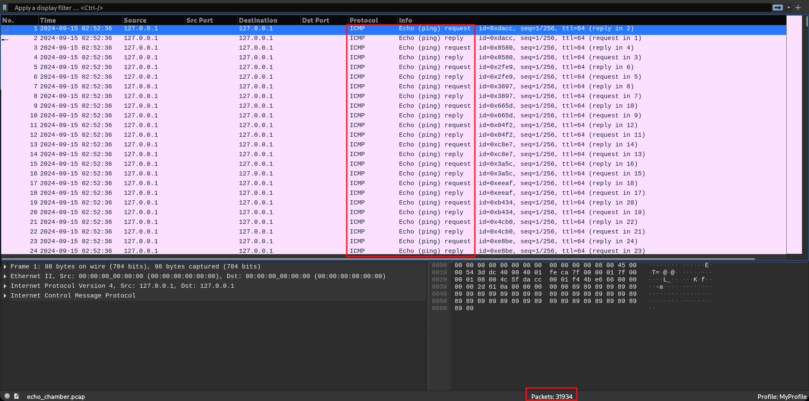
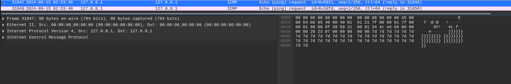
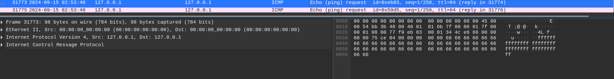
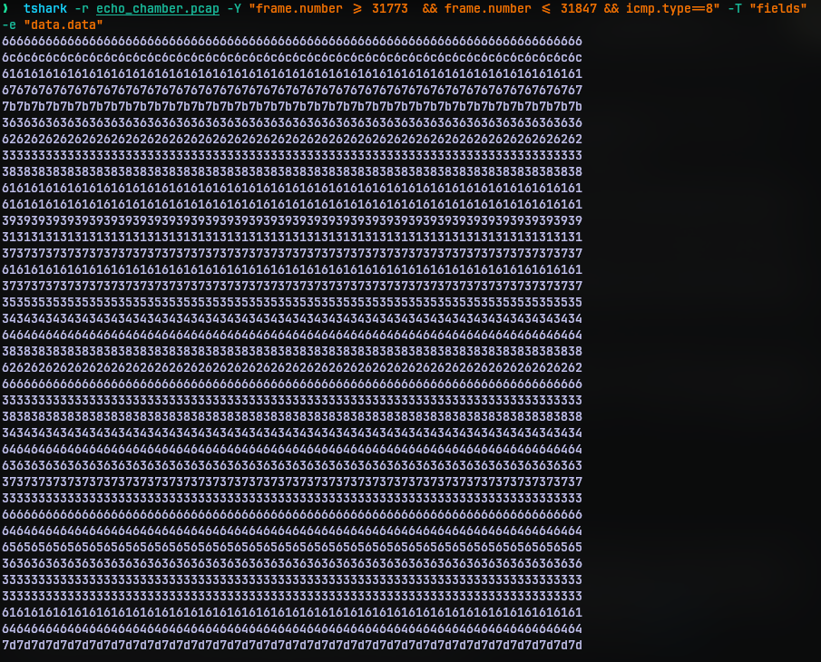
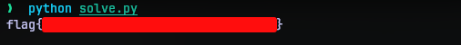

# Base64by32
## Challenge Statement:
Author: @JohnHammond#6971

Is anyone there? Is anyone there? I'm sending myself the flag! I'm sending myself the flag!

Attachment: [echo_chamber.pcap](echo_chamber.pcap)

## Solution:
We are presented with a PCAP file. This is data from packet capture and can be opened and read by tools known as packet analyzers. I used a tool called [Wireshark](https://en.wikipedia.org/wiki/Wireshark). 

Opening the PCAP file, I see only ICMP packets. 



There were 31,934 of them to be exact. This could be overwhelming at the start. But we can cut the number to half because they are all echo request and reply packets. They are used to see if there is connectivity between two hosts. A host puts out an echo request packet with some data in it. If it reaches the destination host successfully, it is echoed back, that is, the data is sent back as it received it. So if the data in both request and reply is same, we can choose to filter only one of them. 

I used the filter `icmp.type == 8` as request packets have their type field as 8. Reply packets have type 0, so `icmp.type == 0` will also achieve the same result, except it will display the reply packets.

We still have 15,967 packets. So somewhere in those packets, maybe one or a few packets should contain the flag. I don't know any methods to sieve through them, I just press the arrow keys to move swiftly across packets. 

Another thing about these kind of challenges is they try to bury us with the large number of potential targets. So as a rule of thumb I usually start from the bottom and make my way to the top. But that's just the way I work and this case it was beneficial to me.

When I reached packet with ID 31847, I noticed the data filled with `}` character. Slowly moving my way up, it was filled with hexadecimal characters, then a `{` character and then the characters `g`, `a`, `l`, `f`.  The `f` character was in the packet with ID 31773. 





Hence I found where the flag is. I could have copied it down one by one. But decided to write a script to do the job for me. As always I put together a python script. But before that I need some utility to extract the from the exact packets. This can be done by many ways, but I chose to use the command line utility [tshark](https://tshark.dev/setup/install/). 

First I need to devise a command with tshark to list just the data. The command I ended up using was:

```bash
tshark -r echo_chamber.pcap -Y "frame.number >= 31773  && frame.number <= 31847 && icmp.type==8" -T "fields" -e "data.data"
```

The `-r` switch specifies the file that the program should be reading from. The `-Y` switch is used specify the filter expression. We need packets of type 8 (echo request) and packets between ID 31773 and 31847. That is what the filter expression does. The `-T` switch allows us to edit the output and `fields` specify  we are going the edit the fields that are going to displayed. The `-e` switch is used to specify the what we want to display and in this case we want the packet data. 



Now that we have the data but it is repeated and appears to be in hex rather than characters shown in wireshark. This is probably because tshark deals with that as hex values or I should have been more specific in the command. Nevertheless this is fine. 

So with this data I put together a python script, to take the output of the command, parse it, and the unhex the data to get the flag.

```python
import subprocess
import shlex
import binascii

if __name__=="__main__":
    cmd = 'tshark -r echo_chamber.pcap -Y "frame.number >= 31773  && frame.number <= 31847 && icmp.type==8" -T "fields" -e "data.data"'
    content = subprocess.check_output(
            shlex.split(shlex.quote(cmd)), shell=True, stderr=subprocess.STDOUT
        ).decode()
    content = content.split("\n")
    hexvals = "".join([con[:2] for con in content])
    print(binascii.unhexlify(hexvals).decode())
```

I used subprocess and shlex modules from the python library to execute the tshark command and did some clean up. Finally used `unhexlify` from binascii module to decode the output.




