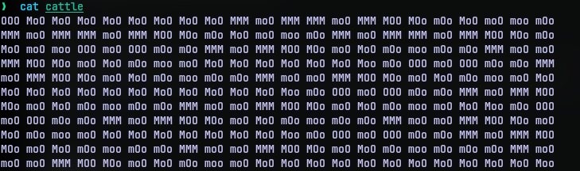
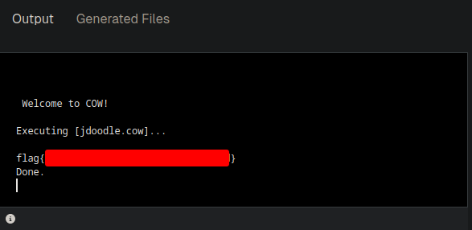

# Cattle
## Challenge Statement:
Author: @JohnHammond

I know it's an esoteric challenge for a Capture the Flag, but could you herd these cows for me?

Attachment: [cattle](cattle)

## Solution:
After downloading the file given and reading it, I found it filled with variations of moo, ooo, mmo and so on.

Since I spend some time with esoteric languages I recognized this as a programming language called [COW](https://esolangs.org/wiki/COW).
So all I did was find an online code execution environment and ran it. I used [this](https://www.jdoodle.com/execute-cow-online) from JDoodle and got the flag.

