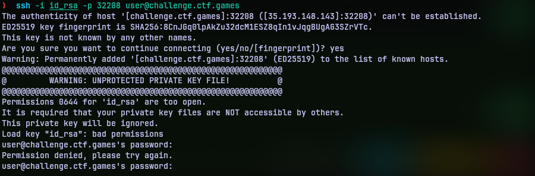
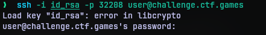
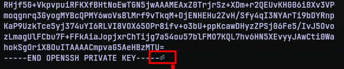
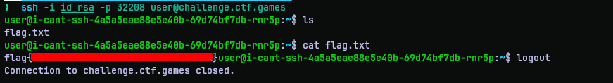

# I Can't SSH
## Challenge Statement:
Author: @JohnHammond

I've got this private key... but why can't I SSH?

Attachment: [privkey](privkey)

**Note**: This challenge was accompanied with a per-user instance

## Solution:
Opening the file reveals that it is a OpenSSH Private key. So in theory it should be able to get us into a SSH server enabled account with the corresponding public key. So I try to SSH into the instance I spun up.



I get an error message stating that SSH key is too open. It is true that SSH keys should not be read by anyone other than the user it was intended to. So I fix it by setting the permission to ```600``` with chmod as:

```bash
chmod 600 id_rsa 
```

Retrying to connect, I was met with another error message.



So I finally decide to take a close look into the file. After a few minutes and a few searches I noticed the newline character was missing at the end of the key file.



So I added a newline with:

```bash
echo "" >> id_rsa
```

Trying to SSH again, I was successfully able to connect to the instance via SSH. The flag was in a file flag.txt right there. Reading the file revealed the flag.



