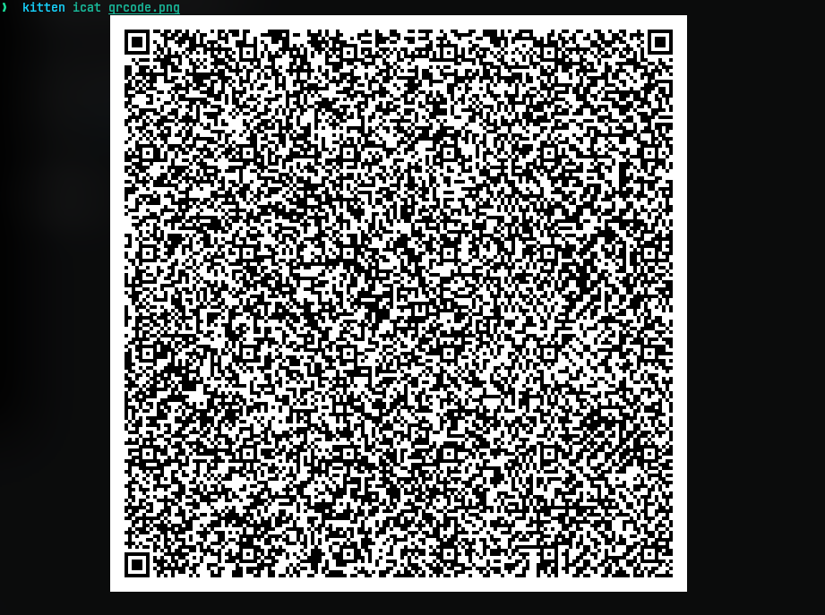

# MatryoshkaQR
## Challenge Statement:
Author: @JohnHammond

Wow! This is a **_big_** QR code! I wonder what it says...?

Attachment: [qrcode.png](qrcode.png)

## Solution:
As we can see the given file is a [QR code](https://en.wikipedia.org/wiki/QR_code).



So obviously I scanned it using [zbarimg](https://github.com/mchehab/zbar) with the command:

```
zbarimg -q --raw qrcode.png
```

On scanning the QR code I got a string that looked like this:

```
\x89PNG\r\n\x1a\n\x00\x00\x00\rIHDR\x00\x00 ... \x00\x00\x00\x00IEND\xaeB`\x82
```

This is binary data. And if you have worked with [magic numbers](https://en.wikipedia.org/wiki/Magic_number_%28programming%29#In_files) and PNG files, you'd see the PNG file signature and IHDR and IEND which are PNG headers. So what we have is PNG data in binary encoded format.

But the problem is this not exactly in binary. So we need to convert the string to actual binary. So I used python to do the job.

```py
binary_data=b"<data from the png>"
with open('qr1.png', 'wb') as png_file:
    png_file.write(binary_data)
```

Moving onto the next image, we find another QR code, hence the name of the challenge. 


So again I scan the QR code using the same command as above and it gave the flag.


