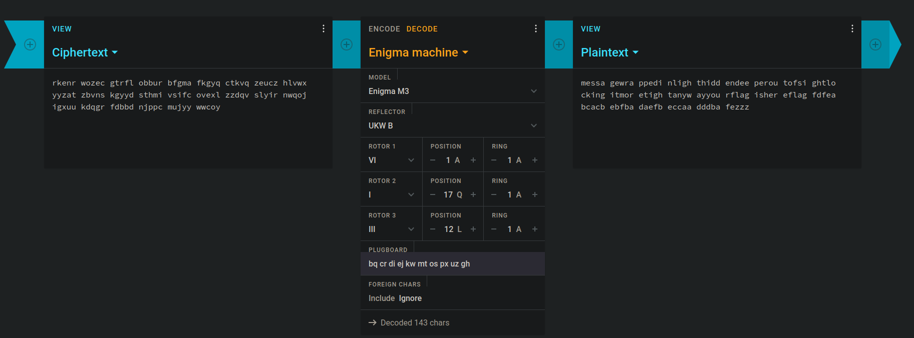
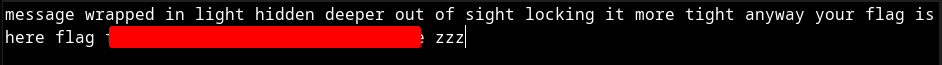

# Mystery
## Challenge Statement:
Author: @Michael

Someone sent this to me...  

_such enigma, such mystery:_  

`rkenr wozec gtrfl obbur bfgma fkgyq ctkvq zeucz hlvwx yyzat zbvns kgyyd sthmi vsifc ovexl zzdqv slyir nwqoj igxuu kdqgr fdbbd njppc mujyy wwcoy`  

**Settings as below:**
-   3 Rotor Model
-   Rotor 1: VI, Initial: A, Ring A
-   Rotor 2: I, Initial: Q, Ring A
-   Rotor 3: III, Initial L, Ring A
-   Reflector: UKW B
-   Plugboard: `BQ CR DI EJ KW MT OS PX UZ GH`

## Solution:
This challenge had no attachment to download. So all we have is a cipher text and some "settings". From my recollection of the movie [The Imitation Game](https://en.wikipedia.org/wiki/The_Imitation_Game) I remember that the [Enigma machine](https://en.wikipedia.org/wiki/Enigma_machine) had rotors and some sort of plugboards. 

That and the enigma in the challenge description strongly suggested we have a enigma cipher with key. I don't have a enigma machine, luckily I found [this](https://cryptii.com/pipes/enigma-decoder) decoder. I put in the ciphertext, plugged in the setting and got an output.

I don't know about you all if you noticed. But I missed it. I thought there was another level of cipher to the output and tried a few cipher decoding but none worked. Then I saw it. The message is right there, except white space in the wrong place. I forgot enigma does that. So copying it to a text editor and modifying it I got:

After some text the flag is given. Since enigma doesn't support anything other than alphabets, I guessed it is implied we have to put the curly braces in the flag. And it was right.

