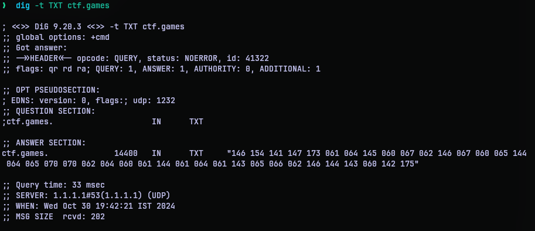
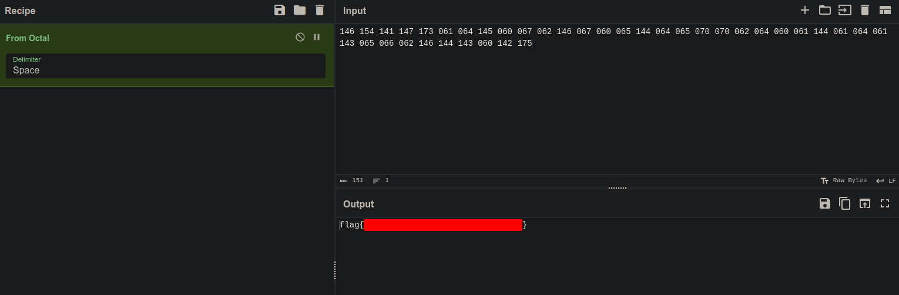

# TXT Message
## Challenge Statement:
Author: @JohnHammond

Hmmm, have you seen some of the strange DNS records for the `ctf.games` domain? One of them sure is [od](https://en.wikipedia.org/wiki/Od_(Unix))d...

## Solution:
The challenge description suggests some strange DNS records with `ctf.games` I decided to lookup the DNS records. Further the title of the challenge says more. Since I put some time studying DNS protocol I am familiar with a `TXT` query type that pulls the text data given by the domain administrator. 

Hence using the `dig` command from the [bind](https://www.isc.org/bind/)  with the query:

```bash
dig -t TXT ctf.games
```



We find a bunch of data in the answer section. It took me a few minutes but I recognized it is octal data. So plug it into Cyberchef and I got the flag.



On a unrelated note, I found there is a link to od in the challenge description which is a tool for octal dump while writing this writeup, suggesting we might encounter octal data. But I didn't notice it.

