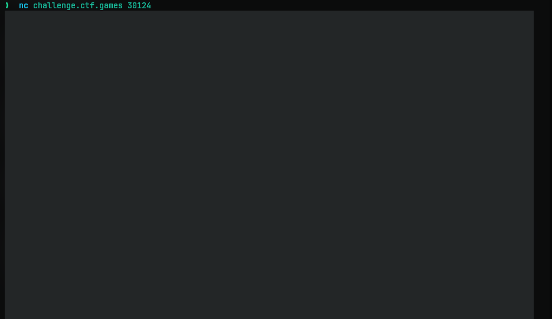
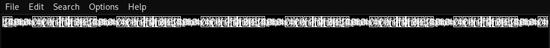
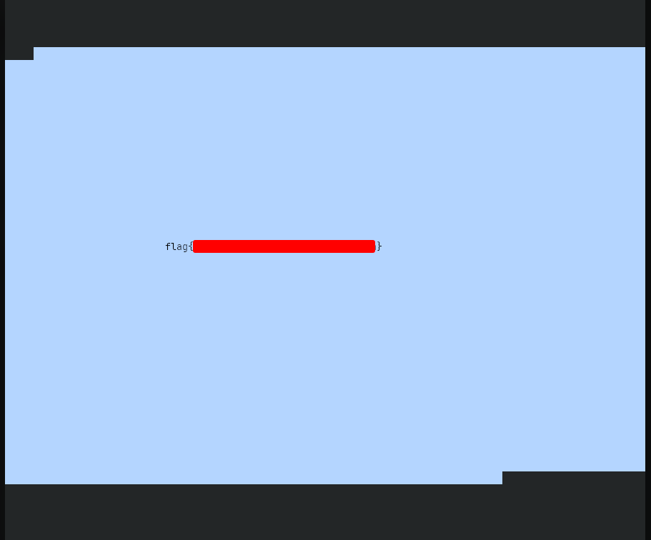

# The Void
## Challenge Statement:
Author: @JohnHammond#6971

When you gaze long into the void, the void gazes also into you...

**Note**: This challenge was accompanied with a per-user instance

## Solution:
This challenge had no attachment to download. We are to use netcat to connect to a given instance. Doing so printed grey block characters such as in the image below:

At first I had no idea what it was. I redirected the output to a file with the below command and opened it in a text editor and it was not really readable to start with.

So based on the challenge description I decided to run it for something thinking it was a sort of timing thing. Run it long enough and maybe it prints out the flag. So I did it.

I ran it quite a while and got bored. I have habit of dragging and selecting text when I'm waiting for some command to finish up. I did that and noticed some text move in the output. I stopped the program and started selecting the text and the flag was right there.

I'm not sure whether this is the intended way to solve this. But yeah, got the flag.

