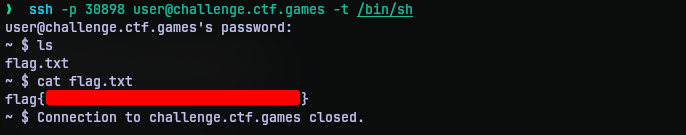

# Typo
## Challenge Statement:
Author: @JohnHammond

Gosh darnit, I keep entering a typo in my Linux command prompt!

**Note**: This challenge was accompanied with a per-user instance

## Solution:
This challenge requires us to SSH into a provisioned per-user instance with the given password. While doing so, I was met with a train. 


 If you have been around the linux community for sometime, you should have been familiar with the `sl` command. This command was intended to show the user that they mistyped `ls` in a fun way. 

 But our problem is the connection shows us the train and exits without providing us a chance to interact with the instance. I thought it was because of hard-coded .bashrc file that  contained `sl` command and made the shell exit.

 So I worked around it with by specifying the shell to use when connecting to the instance. Since my theory was that it was because of .bashrc file, I intended to use another shell other than bash. Since almost all system contains the `sh` shell, I thought of using it.
 
 With the following command, I SSHed into the instance and this time I got an interactive shell. 

 ```bash
 ssh -p <port> user@challenge.ctf.games -t /bin/sh
 ```

 The flag was in a flag.txt in the directory right there.



