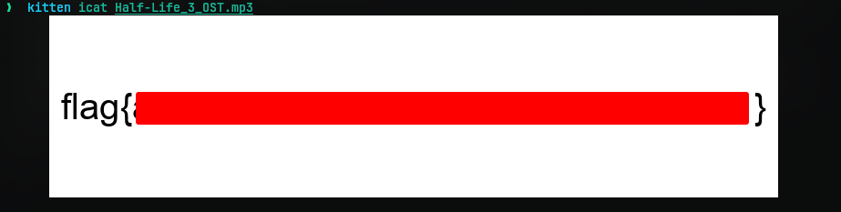
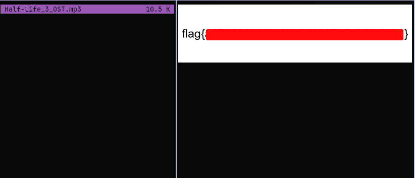

# Unbelievable
## Challenge Statement:
Author: @JohnHammond

Don't believe everything you see on the Internet!  
  
Anyway, have you heard this intro soundtrack from Half-Life 3?

Attachment: [Half-Life_3_OST.mp3](Half-Life_3_OST.mp3)

## Solution:
Downloading the file, it seems to be an MP3 audio. So I played it with aplay from ALSA driver. It actually played but it was just random noise for a couple seconds. 

Since the challenge description tells about misinformation I decided to check if it is really a audio file. So I checked it with the file utility.

So it appears this is not an audio at all. I have no idea how `aplay` played it. So anyway treating it as a image file and I opened it and the flag was in the image. 

One might use OCR techniques to read the flag or just type from it manually.

Bonus point: If you use something like the [ranger](https://github.com/ranger/ranger) file browser, it just shows you the flag directly. No fuss.

