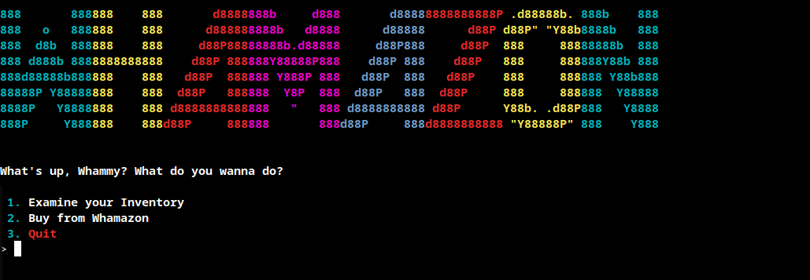
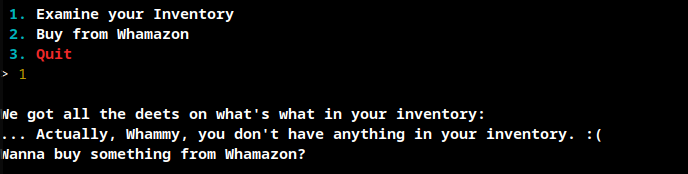
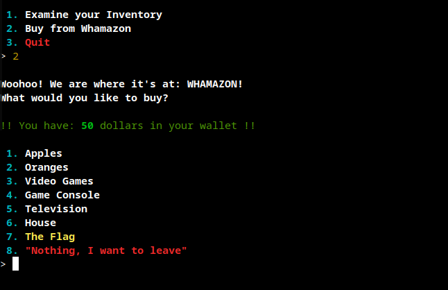
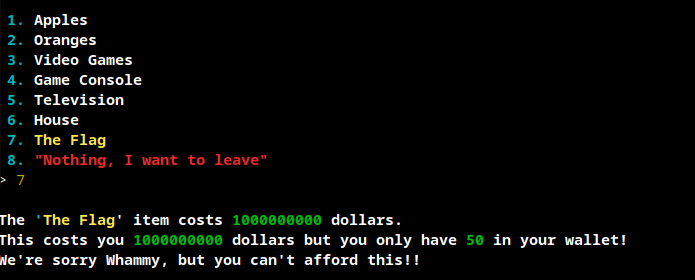
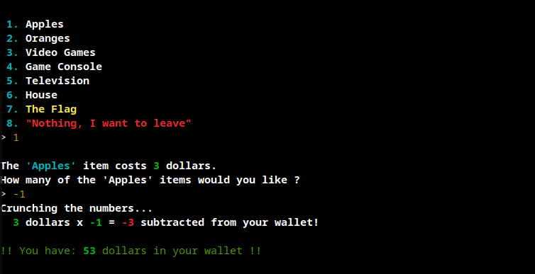
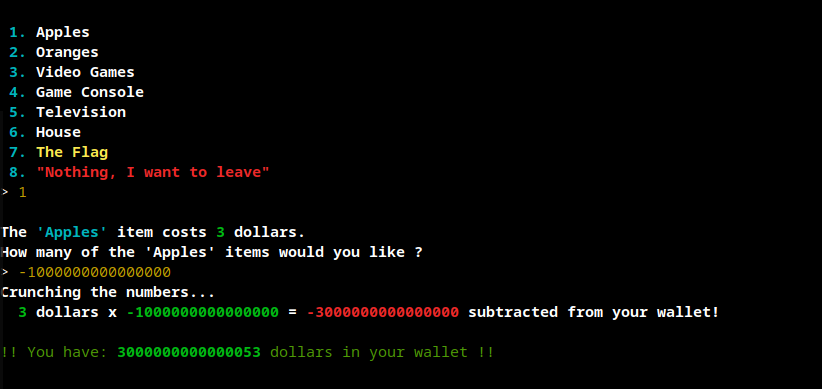
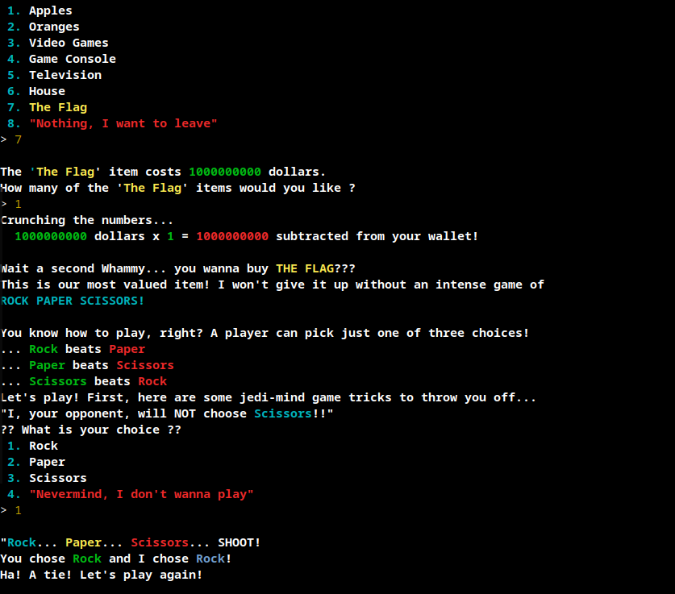
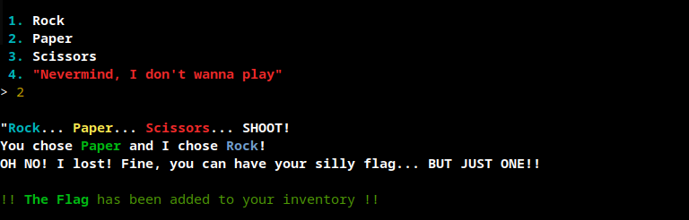
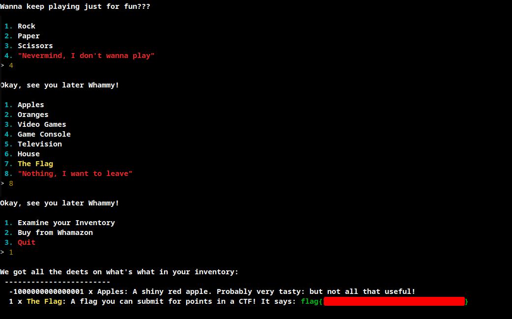

# Whamazon
## Challenge Statement:
Author: @JohnHammond

Wham! Bam! Amazon is entering the hacking business! Can you buy a flag?

**Note**: This challenge was accompanied with a per-user instance

## Solution:
Starting the instance, I was provisioned a URL to an page. It was a [GoTTY](https://github.com/yudai/gotty) application. I was greeted with a menu to begin with.

Examining the inventory, it tells that we have to buy something.

So, I decided to look at what was for sale.

It appears we have 50 dollars in my account and among many items the flag was also listed. So I went ahead and tried to buy it.

So we need quite the sum of money to buy the flag. At this point I thought there would be some session variable or token that contains the available balance on my account. I even went to inspect the web socket traffic and decode it in attempts to find it. 

And then it hit me. I tried to buy -1 quantity of Apples. And it worked. 

So it is one of the oldest tricks in the book, insufficient input validation. So we should be able to use this to add money to our account and buy the flag. And that's exactly what I did.

So now that I have the balance I went ahead and bought the flag. But that's not it. I was invited to a Rock, Paper, Scissors and the program said it won't choose scissors. So I chose rock. It was a tie.

It played rock everytime, so when I chose paper I won and it said the flag was added to my inventory.

Then I quit the game and the buy menu and opened my inventory. The flag was right there.

