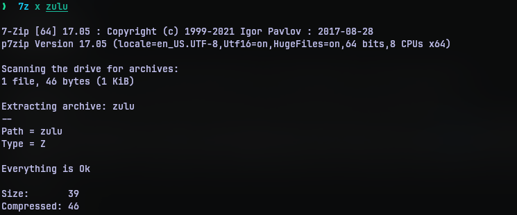

# Zulu
## Challenge Statement:
Author: @JohnHammond

Did you know that zulu is part of the phonetic alphabet?

Attachment: [zulu](zulu)

## Solution:
Downloading the file and running file utility on it revealed that it is compressed data.


Now I didn't really look into the extact compression tool used because I use the [p7zip](https://github.com/p7zip-project/p7zip) utility. This can decompress any archive regardless of compression algorithm(generally used compression algorithms). So I decompressed the data with:

```bash
7z x zulu
```




On opening the new uncompressed file, I found the flag.


